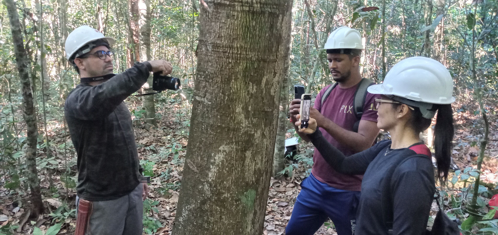
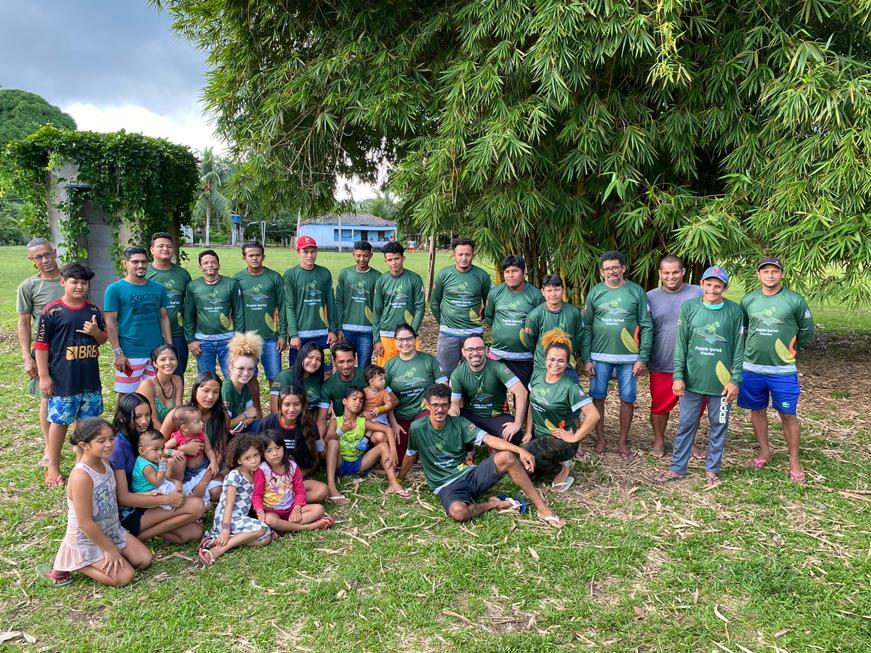

<!-- README.md is generated from README.Rmd. Please edit that file... -->

<!-- badges: start -->
<!-- badges: end -->

```{r, include = FALSE}
knitr::opts_chunk$set(
  collapse = TRUE,
  comment = "#>"
)
library(magrittr)
repo <- "FL03029-Dendrometria"
```

<!-- Emprestei a função list_github_files() da Curso-R. (https://github.com/curso-r). A ideia desse readme emprestei da Curso-R. Achei excelente!-->

```{r, include = FALSE}
list_github_files <- function(repo, dir = NULL, ext = NULL) {

  req <- httr::GET(
    paste0(
      "https://api.github.com/repos/DeivisonSouza/",
      repo,
      "/git/trees/master?recursive=1"
    )
  )

  httr::stop_for_status(req)

  arquivos <- unlist(
    lapply(httr::content(req)$tree, "[", "path"),
    use.names = FALSE
  )

  if (!is.null(dir)) {
    arquivos <- grep(dir, arquivos, value = TRUE, fixed = TRUE)
  }

  if (!is.null(ext)) {
    arquivos <- arquivos[grep(paste0(ext, "$"), arquivos)]
  }

  return(arquivos)
}
```

# Seja bem vindo(a)! :deciduous_tree: :smiley: :grin:

:calendar: Abril: 30

:calendar: Maio: 7, 14, 21, 28

:calendar: Junho: 4, 11, 18, 25

:calendar: Julho: 2, 9

:calendar: Agosto: 6

:alarm_clock: **08h00min - 12h50min**


<div>
  
  
<div>

<div itemscope itemtype="https://schema.org/Person"><a itemprop="sameAs" content="https://orcid.org/0000-0002-2975-0927" href="https://orcid.org/0000-0002-2975-0927" target="orcid.widget" rel="me noopener noreferrer" style="vertical-align:top;">https://orcid.org/0000-0002-2975-0927</a></div>

**Lattes**: [http://lattes.cnpq.br/9063094443073532](http://lattes.cnpq.br/9063094443073532)

**Researchgate**: [https://www.researchgate.net/profile/Deivison-Souza](https://www.researchgate.net/profile/Deivison-Souza)

**Siga o Instagram**: [@lmftca_ufpa](https://www.instagram.com/lmftca_ufpa/) (Laboratório de Manejo Florestal, Tecnologias e Comunidades Amazônicas)

**Site do LMFTCA**:
[https://www.lmftca.com.br/](https://www.lmftca.com.br/)
(Laboratório de Manejo Florestal, Tecnologias e Comunidades Amazônicas)

---------------------------------------------------

# Dendrometria (FL03029)

Este repositório guarda os slides em .html, códigos R, arquivos .Rmd, figuras, conjunto de dados (e outros) utilizados na disciplina de **Dendrometria** (FL03029) ministrada pelo **Prof. Deivison Venicio Souza** no curso de graduação em **Engenharia Florestal** da **Universidade Federal do Pará** (UFPA). O curso será ofertado na **modalidade presencial**, conforme dispõe a [Resolução  n. 5.453, de 14 de dezembro de 2021](https://sege.ufpa.br/boletim_interno/downloads/resolucoes/consepe/2021/5453%20Aprova%20a%20Resolu%C3%A7%C3%A3o%20sobre%20o%20retorno%20das%20Atividades%20Presenciais.pdf) e em consonância à [Resolução  n. 5.845, de 16 de dezembro de 2024](https://sege.ufpa.br/boletim_interno/downloads/resolucoes/consepe/2024/5845%20Aprova%20o%20Calend%C3%A1rio%20Acad%C3%AAmico%20da%20UFPA%20-%202025.pdf), que aprovou o Calendário Acadêmico da Universidade Federal do Pará para o ano de 2025.

# Programação da disciplina

A programação, o conteúdo e os slides da disciplina **Dendrometria** (FL03029) estão detalhados a seguir.

```{r, echo = FALSE}
knitr::kable(
  tibble::tibble(
    Slide = list_github_files(repo=repo, "Slides/", "html"),
    Link = paste0("https://deivisonsouza.github.io/", repo, "/", Slide)
  ) %>% 
    dplyr::filter(!stringr::str_detect(Slide,
                                       "_files/|_cache/|assets"))
)
```

# Facilitador :deciduous_tree:
<div>
  
  
  
  
  
<div>

<br>

<div align="justify">
Graduado em :deciduous_tree:**Engenharia Florestal** (ano 2008) e Mestrado em Ciências Florestais (ano 2011) pela Universidade Federal Rural da Amazônia (UFRA) e Doutorado em Engenharia Florestal pela Universidade Federal do Paraná - UFPR (ano 2020). Também possui Especialização em Data Science e Big Data pela UFPR (ano 2019). Atualmente, é docente Associado I na Universidade Federal do Pará (UFPA), atuando no curso de Graduação em Engenharia Florestal e no Programa de Pós-Graduação em Biodiversidade e Conservação (PPGBC). É responsável por ministrar as disciplinas de Estatística Básica, Dendrometria, Experimentação Florestal e Inventário Florestal no Curso de Graduação em Engenharia Florestal da UFPA, e a disciplina de Estatística Computacional no PPGBC. Coordena projetos de pesquisas orientados ao manejo e conservação da biodiversidade, com ênfase no desenvolvimento de tecnologias baseadas em inteligência artificial e visão computacional para o reconhecimento automático de espécies da flora Amazônica. Também tem contribuído em projetos socioambientais junto aos povos originários, em parceria com a Associação Indígena Pyjahyry Xipaya - AIPHX, com ênfase na estruturação e fortalecimento de cadeias de produtos da sociobiodiversidade e gestão territorial e ambiental.
</div>

---------------------------------------------------
**Este repositório está licenciado nos termos da licença MIT.**
