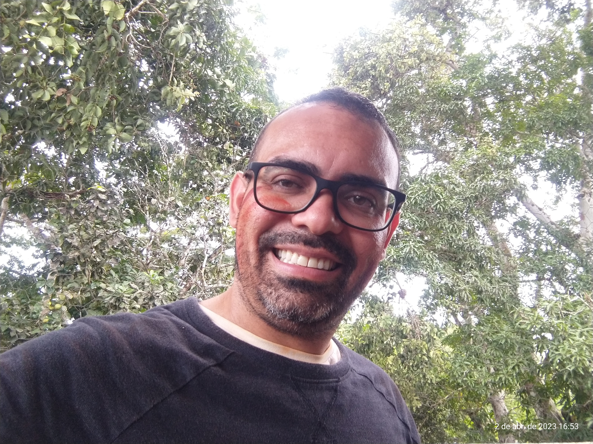
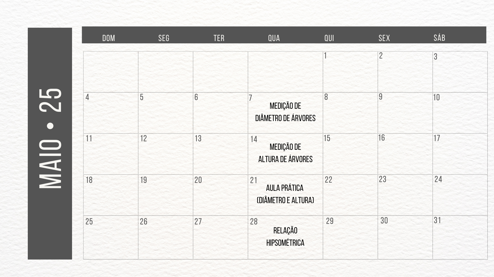
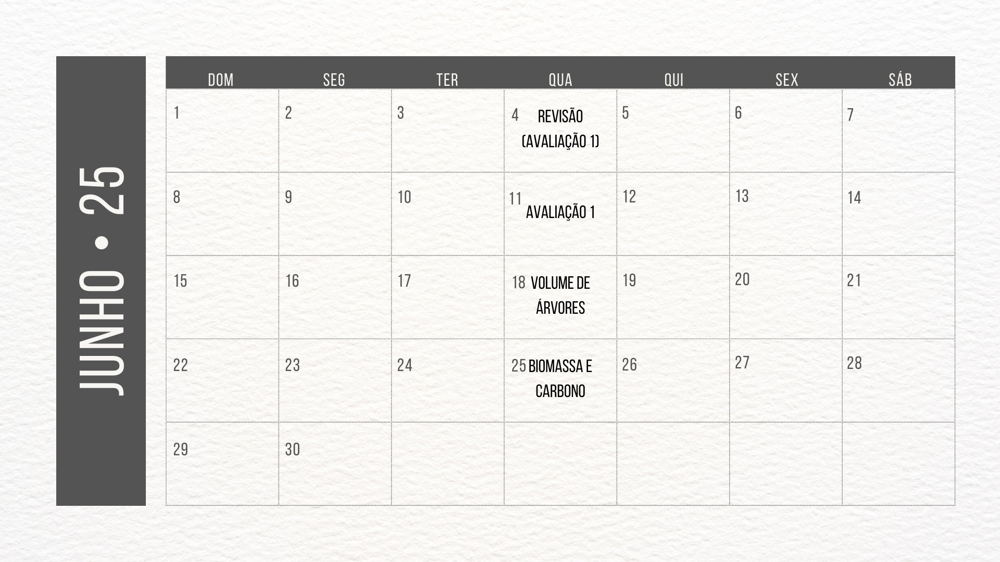
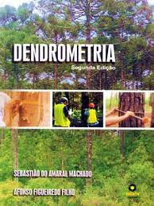

class: title-slide, center, middle
background-image: url(fig/slide-title/LMFTCA.png), url(fig/slide-title/ufpa.png), url(fig/slide-title/capa.png)
background-position: 90% 90%, 10% 90%
background-size: 150px, 150px, cover

```{r setup, include=FALSE}
knitr::opts_chunk$set(
  fig.showtext = TRUE,
  fig.align = "center", 
  cache = FALSE,
  error = FALSE,
  message = FALSE, 
  warning = FALSE, 
  collapse = TRUE ,
  dpi = 600)
```

```{r xaringan-logo, echo=FALSE}
library(xaringanExtra)
use_logo(
  image_url = "fig/slide-title/ufpa.png",
  position = css_position(top = ".8em", right = "-.5em"),
  width = "140px",
  height = "140px"
)
```

```{r icon, echo=FALSE}
#remotes::install_github("mitchelloharawild/icons")
#remotes::install_github('emitanaka/anicon')
#library(icons)
#download_fontawesome()
#download_simple_icons()
```


<!-- title-slide -->
# .font120[Dendrometria <br> (FL03029 - EF)]

## `r anicon::faa("pagelines", animate="horizontal", colour="green")` Programação da Disciplina `r anicon::faa("pagelines", animate="horizontal", colour="green")` <br> 🌲🌳🌲🌳🌲🌳🌲🌳
###### Período Letivo 2025.2

##### 〰〰〰〰〰〰🌱〰〰〰〰〰〰
##### ᨒ
##### .font120[**Prof. Dr. Deivison Venicio Souza**]
##### Universidade Federal do Pará (UFPA)
##### Faculdade de Engenharia Florestal
##### Laboratório de Manejo Florestal, Tecnologias e Comunidades Amazônicas
##### E-mail: deivisonvs@ufpa.br
<br>
##### 1ª versão: 24/janeiro/2022 <br> (Atualizado em: `r format(Sys.Date(),"%d/%B/%Y")`) <br> Altamira, Pará

---
layout: true
<div class="my-header"></div>
<div class="my-footer"><span>Prof. Dr. Deivison Venicio Souza (E-mail: deivisonvs@ufpa.br)&emsp;&emsp;&emsp;&emsp;&emsp;Dendrometria (FL03029 - EF) - Programação e Orientações </div>

---

## 👋 Olá, sejam bem vindos!
<br>
### **Sobre o facilitador**

.pull-left[
.font60[
1. .green[Graduação (Titulação: ano 2008)]
    - Universidade Federal Rural da Amazônia (UFRA); e
    - Título: Bacharel em Engenharia Florestal.
    
2. .green[Mestrado (Titulação: ano 2011)]
    - Universidade Federal Rural da Amazônia (UFRA);
    - Programa de Pós-graduação em Ciências Florestais (PPGCF); e
    - Área de Concentração: Manejo de ecossistemas florestais.

3. .green[Especialização (Titulação: ano 2019)]
    - Universidade Federal do Paraná (UFPR);
    - Área: Big Data e Data Science
    
4. .green[Doutorado (Titulação: ano 2020)]
    - Universidade Federal do Paraná (UFPR);
    - Programa de Pós-graduação em Engenharia Florestal (PPGEF); e
    - Área de Concentração: Manejo Florestal.
]
]

.pull-right[
```{r echo = FALSE, out.width='90%', fig.align='center', fig.cap='', dpi=600}

```
]

---

## 👋 Olá, sejam bem vindos!
<br>
### **Sobre o facilitador**

.pull-left[
.font90[
#### **Interesses atuais**
1. .green[Linguagem de programação]
    - R
    - Python

2. .green[Modelagem preditiva aplicada à ciência florestal]
    - Aprendizado de máquina
    
3. .green[Visão computacional]
    - reconhecimento de espécies baseado em imagens
    
4. .green[Criação de Dashboard - Shiny]
]
]

.pull-right[
.font90[
#### **Websites e contatos**

`r icons::simple_icons("github")` GitHub: https://github.com/DeivisonSouza

<span class="iconify" data-icon="fa-brands:orcid" data-inline="false"></span>


<div itemscope itemtype="https://schema.org/Person"><a itemprop="sameAs" content="https://orcid.org/0000-0002-2975-0927" href="https://orcid.org/0000-0002-2975-0927" target="orcid.widget" rel="me noopener noreferrer" style="vertical-align:top;">https://orcid.org/0000-0002-2975-0927</a></div>

```{r, echo=FALSE, out.width='20%', fig.align='center', fig.cap=''}
knitr::include_graphics('fig/ORCID.png')
```

Email: deivisonvs@ufpa.br
]
]

---

## 👋 Olá, sejam bem vindos!
<br>

### **Projetos de Pesquisa/Extensão finalizados** (com fomento)

.font90[
- 1) Sistema de Visão Computacional para Reconhecer Espécies no Manejo Florestal Madeireiro na Amazônia Brasileira. (**Financiador**: Centro de Indústrias Produtoras e Exportadoras de Madeira do Estado de Mato Grosso - CIPEM) - ([https://cipem.org.br/](https://cipem.org.br/)) <br><br>
- 2) Projeto Ipa’wã (Copaíba): Etnomapeamento e inventário de copaibais nativos na TI Xipaya (Aldeias Tukamã, Tukayá e Kaarimã). (**Financiador**: Fundo Brasileiro para a Biodiversidade - FUNBIO) - ([https://www.funbio.org.br/](https://www.funbio.org.br/)) (Parceria entre Associação Indígena Pyjahyry Xipaia – AIPHX e UFPA)
<br>

----------------------------------------

**Siga o Instagram**: [@pyjahyryxipaia](https://www.instagram.com/pyjahyryxipaia/) (Associação Indígena Pyjahyry Xipaia)

**Siga o Instagram**: [@lmftca_ufpa](https://www.instagram.com/lmftca_ufpa/) (Laboratório de Manejo Florestal, Tecnologias e Comunidades Amazônicas)

**Site do LMFTCA**:
[https://www.lmftca.com.br/](https://www.lmftca.com.br/)
(Laboratório de Manejo Florestal, Tecnologias e Comunidades Amazônicas)
]

---

## Ementa da disciplina (FL03029)
<br>
.shadow2[
<br>
1 - Introdução à Dendrometria

2 - Medição de Diâmetros de Árvores

3 - Medição de Alturas de Árvores

4 - Relação Hipsométrica

5 - Estudo da Forma do Tronco das Árvores

6 - Volume de Árvores (Métodos de Cubagem)

7 - Biomassa e Carbono Florestal

8 - Método de Bitterlich - Relascopia 

]

<!-- Slide 2 -->
---

## Cronograma .black[.font80[(**Horário: 08h00min - 12h30min**)]]
<br>

```{r, echo = FALSE, out.width='80%', fig.align='center', fig.cap='', dpi=600}

```

<!-- Slide 2 -->
---

## Cronograma .black[.font80[(**Horário: 08h00min - 12h30min**)]]
<br>

```{r, echo = FALSE, out.width='80%', fig.align='center', fig.cap='', dpi=600}

```

<!-- Slide 2 -->
---

## Cronograma .black[.font80[(**Horário: 08h00min - 12h30min**)]]
<br>

```{r, echo = FALSE, out.width='80%', fig.align='center', fig.cap='', dpi=600}

```

<!-- Slide 2 -->
---

## Cronograma .black[.font80[(**Horário: 08h00min - 12h30min**)]]
<br>

```{r, echo = FALSE, out.width='80%', fig.align='center', fig.cap='', dpi=600}

```

<!-- Slide 2 -->
---

## Cronograma .black[.font80[(**Horário: 08h00min - 12h30min**)]]
<br>

```{r, echo = FALSE, out.width='80%', fig.align='center', fig.cap='', dpi=600}

```

<!-- Slide 7 -->
---
## Estratégias e Ferramentas de Ensino
<br>

- **Aula Presencial** (*Faculdade de Engenharia Florestal*)

Aulas teóricas e práticas presenciais, realização de atividades complementares e avaliações de desempenho.

--
<br>

-------------------------------------------------------------------

- **Turma virtual** (*SIGAA*)

Comunicação, envio de atividades complementares e de conteúdos digitas.

--
<br>

-------------------------------------------------------------------

- **Repositório GitHub**

Repositório com os slides em .html, arquivos .R e .Rmd, figuras, conjunto de dados (e outros). O repositório pode ser acessado em: [FL03029-Dendrometria](https://github.com/DeivisonSouza/FL03029-Dendrometria)


<!-- Slide 8 -->

---
## Estratégias de avaliação da aprendizagem
<br>

- **Atividades práticas**

Exercícios com dados reais (quando possível) para aprendizado da matemática e estatísticas inerentes ao conteúdo abordado;

Construção de instrumentos de medições e aulas de campo (floresta/plantações)

--
<br>

-------------------------------------------------------------------

- **Avaliação teórica**

Avaliações teóricas presenciais.

--
<br>

-------------------------------------------------------------------

- **Participação** 

O nível de participação e interação nas aulas presenciais poderá ser critério para definir uma pontuação extra nas avaliações teóricas.


<!-- Slide 9 -->
---
## Média Final e Conceito

$$
\Large
MF = \frac{(NA*2)+NPT}{3}
$$

**MF** = Média Final

**NA** = Nota das Atividade (Soma das atividades será 10 pts.)

**NPT** = Nota das Provas Teóricas (Soma das provas será 10 pts.)

<br>

| Conceito     | Intervalo      |
|--------------|----------------|
| Excelente    | 9,0 ≤ MF ≤ 10    |
| Bom          | 7,0 ≤ MF ≤ 8,9   |
| Regular      | 5,0 ≤ MF ≤ 6,9 |
| Insuficiente | 0 ≤ MF ≤ 4,9   |


<!-- Slide 10 -->
---
## Plano de Ensino
<br><br>

O plano de ensino da disciplina pode ser acessado em:

[Plano de Ensino (FL03029 - Dendrometria)](https://github.com/DeivisonSouza/FL03034-EF/blob/master/Slides/PE/EF-PE.pdf)


<!-- Slide 11 -->
---
## Reprovação
<br>
Conforme o Regimento Geral da UFPA, será considerado reprovado o discente que:

- Obtiver o conceito Insuficiente (INS), isto é, nota inferior a 5 (cinco); (.green[**Aplicável**])
- Sem Avaliação (SA); ou (.green[**Aplicável**])
- Não obtiver a frequência mínima de 75% na disciplina, isto é, Sem Frequência (SF). (.green[**Aplicável**])


<!-- Slide 12 -->
---

## Normativas da UFPA

- [Regimento geral da UFPA de 29/12/2006](chrome-extension://efaidnbmnnnibpcajpcglclefindmkaj/https://www.ufpa.br/images/docs/regimento_geral.pdf)

Disciplina os aspectos gerais e comuns da estruturação e do funcionamento dos órgãos e serviços da Universidade Federal do Pará (UFPA), cujo Estatuto regulamenta. 

- [Resolução n. 4.399, de 14 de maio de 2013](chrome-extension://efaidnbmnnnibpcajpcglclefindmkaj/http://www.proeg.ufpa.br/images/Artigos/Academico/Downloads/Regulamento_de_Graduacao.pdf)

Aprova o Regulamento do Ensino de Graduação da Universidade Federal do Pará.

- [Resolução  n. 5.845, de 16 de dezembro de 2024](https://sege.ufpa.br/boletim_interno/downloads/resolucoes/consepe/2024/5845%20Aprova%20o%20Calend%C3%A1rio%20Acad%C3%AAmico%20da%20UFPA%20-%202025.pdf)

Aprovou o Calendário Acadêmico da Universidade Federal do Pará para o ano de 2025.


<!-- Slide 12 -->
---

## Bibliografia básica

<br>
.pull-left-4[
BATISTA, J. L. F.; COUTO, H. T. Z.; SILVA FILHO, D. F. **Quantificação de Recursos Florestais: árvores, arvoredos e florestas**. 1ª ed. - São Paulo, SP: Oficina de Textos, 2014. 384 p.
]

.pull-right-4[
```{r, echo=FALSE, out.width='65%', fig.align='center', fig.cap='', dpi=600}
knitr::include_graphics('https://editoraufv.cdn.plataformaneo.com.br/produto/multifotos/hd/quantificacao-de-recursos-florestais84836978.jpg')
```

]

---

## Bibliografia básica

<br>
.pull-left-4[
CAMPOS, J. C. C.; LEITE, H. G. **Mensuração florestal: perguntas e respostas**. 3ª ed. - Viçosa, MG: Ed. UFV, 2009. 548 p.
<br><br>

**.green[Já está disponível 5ª Edição!]**

*Perguntas e Respostas - 5ª Edição, atualizada e ampliada*
]

.pull-right-4[
```{r, echo=FALSE, out.width='65%', fig.align='center', fig.cap='', dpi=600}
knitr::include_graphics('https://editoraufv.cdn.plataformaneo.com.br/produto/multifotos/hd/1591464mensuracao-florestal-ufv66456241.jpg')
```

]


---

## Bibliografia básica

<br>
.pull-left-4[
SOARES, C. P. B.; PAULA NETO, F.; SOUZA, A. L. **Dendrometria e Inventário Florestal**. 2ª ed. - Viçosa, MG: Ed. UFV, 2011. 272 p.
<br><br>

**.green[Capítulos do livro estão na Web]** `r anicon::faa("hand-point-down", animate="vertical")`

Link: http://www.mensuracaoflorestal.com.br/sobre-o-site


]

.pull-right-4[
```{r, echo=FALSE, out.width='65%', fig.align='center', fig.cap='', dpi=600}
knitr::include_graphics('https://editoraufv.cdn.plataformaneo.com.br/produto/3492395282_dendrometria-e-inventario-florestal.jpg')
```

]

---

## Bibliografia básica

<br>
.pull-left-4[
MACHADO, S. A.; FIGUEIREDO FILHO, A. **Dendrometria**. Curitiba, 2003. 309p.
<br><br>
]

.pull-right-4[
```{r, echo=FALSE, out.width='65%', fig.align='center', fig.cap='', dpi=600}

```

]

<!-- Slide 14 -->
---

## Bibliografia complementar

<br>
.pull-left-4[
PRODAN, M.; PETERS, R.; COX, F.; REAL, P. **Mensura Forestal**. Agroamerica. 1997.
<br><br>

**.green[Versão em PDF]** `r anicon::faa("hand-point-down", animate="vertical")`

Link: http://repiica.iica.int/docs/B4179e/B4179e.pdf
]

.pull-right-4[
```{r, echo=FALSE, out.width='65%', fig.align='center', fig.cap='', dpi=600}
knitr::include_graphics('http://4.bp.blogspot.com/_1kfg_RxkYUg/S1kvIAVs9_I/AAAAAAAAAEQ/ezRFXAi1ICU/w1200-h630-p-k-no-nu/nuevo-1.jpg')
```
]
