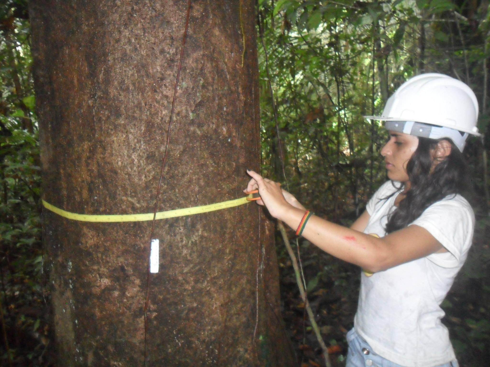
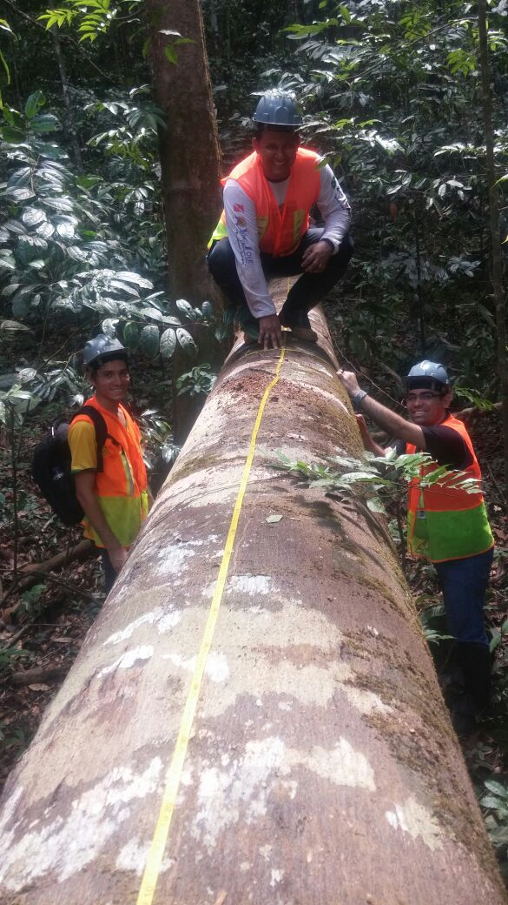
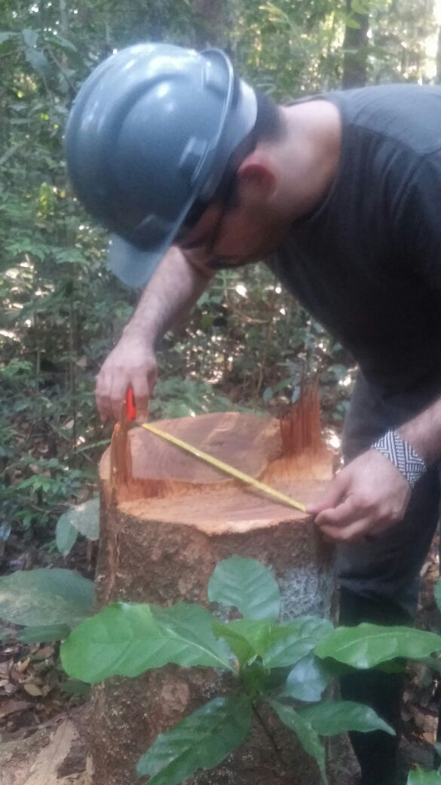
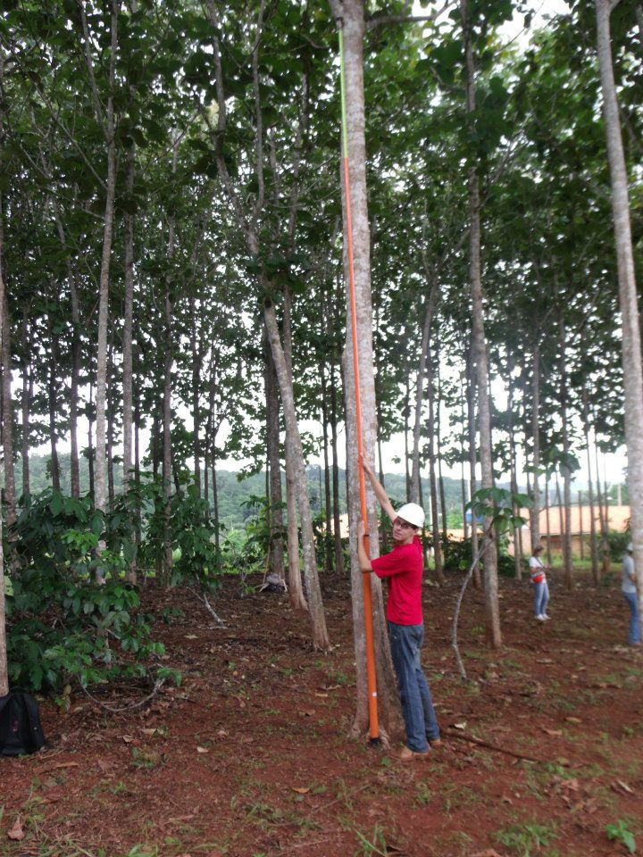
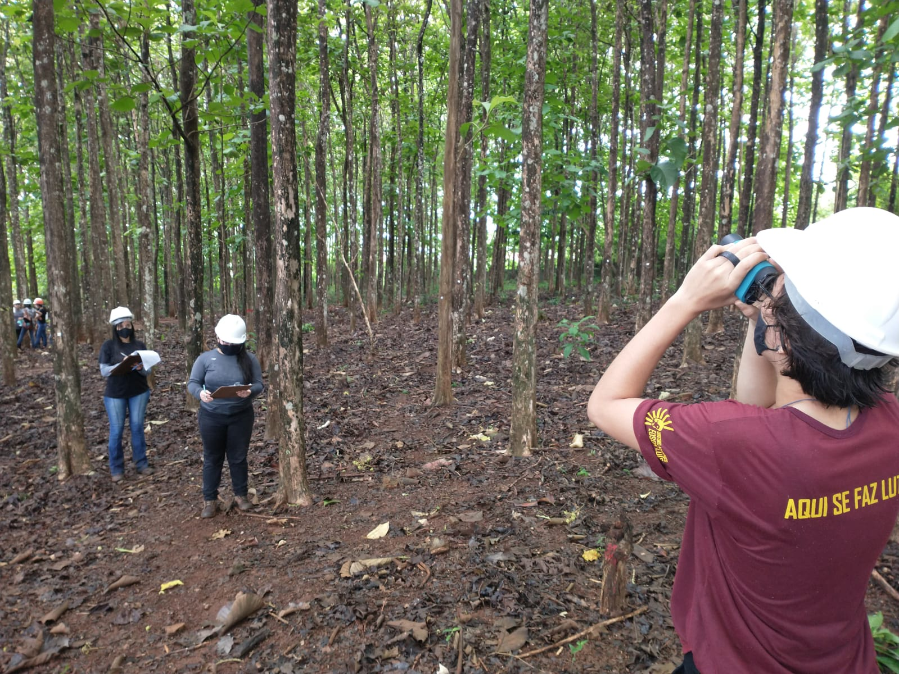
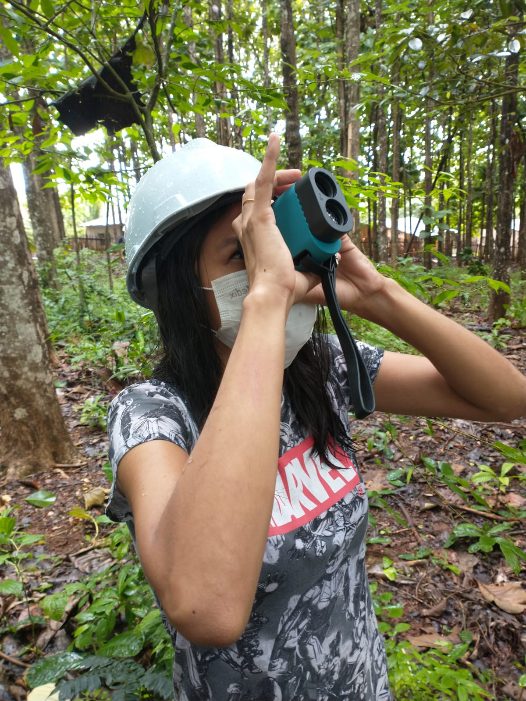

class: title-slide, center, middle
background-image: url(fig/slide-title/ufpa2.png), url(fig/slide-title/forest.png), url(fig/slide-title/img3.png)
background-position: 84% 90%, 95% 90%
background-size: 220px, 90px, cover

```{r setup, include=FALSE}
knitr::opts_chunk$set(
  fig.showtext = TRUE,
  fig.align = "center", 
  cache = TRUE,
  error = FALSE,
  message = FALSE, 
  warning = FALSE, 
  collapse = TRUE ,
  dpi = 600)
```

```{r xaringan-logo, echo=FALSE}
library(xaringanExtra)
use_logo(
  image_url = "fig/slide-title/ufpa.png",
  position = css_position(top = ".8em", right = "-.5em"),
  width = "140px",
  height = "140px"
)
```

```{r icon, echo=FALSE}
#remotes::install_github("mitchelloharawild/icons")
#library(icons)
#download_fontawesome()
#download_simple_icons()
```

<!-- title-slide -->
# Dendrometria <br> (FL03029)
<br><br>
## `r anicon::faa("pagelines", animate="horizontal", colour="green")` Introdução à Dendrometria `r anicon::faa("pagelines", animate="horizontal", colour="green")`

#### **Prof. Dr. Deivison Venicio Souza**
##### Universidade Federal do Pará (UFPA) 
##### Faculdade de Engenharia Florestal
##### E-mail: deivisonvs@ufpa.br
<br>
##### 1ª versão: 24/janeiro/2022 <br> (Atualizado em: `r format(Sys.Date(),"%d/%B/%Y")`) <br> Altamira, Pará

---
layout: true
<div class="my-header"></div>
<div class="my-footer"><span>Prof. Dr. Deivison Venicio Souza (E-mail: deivisonvs@ufpa.br)&emsp;&emsp;&emsp;&emsp;&emsp;Dendrometria (FL03029) - Introdução à Dendrometria</div>

---

## Ementa da disciplina (FL03039 - IF)
<br>

.pull-left-3[
.shadow3[
**1 - Introdução à Dendrometria**

2 - Medição de Diâmetros de Árvores

3 - Medição de Alturas de Árvores

4 - Relação Hipsométrica

5 - Estudo da Forma do Tronco das Árvores

6 - Volume de Árvores (Métodos de Cubagem)

7 - Método de Bitterlich - Relascopia 

8 - Biomassa e Carbono de Árvores

.red[9 - Análise de Tronco]
]
]

---

## Objetivos
<br><br>
Ao final desta aula espera-se que o discente seja capaz de...

* Compreender alguns conceitos básicos, a importância e a correlação da Dendrometria com outras disciplinas;
* Compreender e diferenciar os principais tipos de medidas;
* Compreender os principais erros que podem ser cometidos ao realizar medições de árvores; e
* Compreender a importância da padronização de símbolos dendrométricos e conhecer um guia orientador.

---

## Conteúdo
<br>

.pull-left[
.pull-top[
**Parte 1 - Dendrometria**
.font90[

[1 - Etimologia](#op)

[2 - Sinonímias](#s)

[3 - Conceito e Importância](#ci)

[4 - Relação com outras áreas/disciplinas](#road)

[5 - Variáveis Dendrométricas](#vd)

<br><br>

.font80[**IUFRO**: .blue[*International Union of Forest Research Organizations*] (União Internacional de Organizações de Pesquisa Florestal)]

]
]
]


.pull-right[
.pull-top[
**Parte 2 - Medidas Dendrométricas**
.font90[
[1 - Tipos de Medidas](#tm)

[2 - Erros de Medição](#em)

[3 - Unidades de Medidas](#um)

]
]

<br>

.pull-bottom[
**Parte 3 - Padronização de Símbolos Dendrométricos**
.font90[
[1 - Por que é importante padronizar?](#pip)

[2 - Proposição da IUFRO (1959)](#iufro)

[3 - Iniciativa no Brasil: Padronização da Simbologia em Mensuração e Manejo Florestal (.black[Em discussão])](#ib)
]
]
]

<!-- Slide XX -->
---
layout: false
name: if
class: inverse, middle, center
background-image: url(fig/class1/sec.png)
background-size: cover

.white[.font200[**Dendrometria:**] <br> .font150[Origem, Sinonímia, Conceito e Importância]]

---
layout: true
<div class="my-header"></div>
<div class="my-footer"><span>Prof. Dr. Deivison Venicio Souza (E-mail: deivisonvs@ufpa.br)&emsp;&emsp;&emsp;&emsp;&emsp;Dendrometria (FL03029) - Introdução à Dendrometria</div>

---
name: op
## Dendrometria: Etimologia
<br>

--

.shadow1[
### Etimologia (origem da palavra)
<br>

**Dendrometria** é uma palavra de origem Grega e composta originalmente por duas outras:

<br>.blue[Dendron] = ÁRVORE

.blue[Metria] = MEDIDA

<br>**Significado**: .green[MEDIDA DA ÁRVORE]

]

---
name: s
## Dendrometria: Sinonímias
<br>

--

.shadow1[
### Sinonímias
<br>

No âmbito da Engenharia Florestal, existem algumas sinonímias (palavras de significados iguais ou semelhantes) usadas para dendrometria:

- Dasometria
- Mensuração Florestal
- Silvimetria
- Arborimetria

]

---
name: ci
## Dendrometria: Conceito e Importância
<br>

--

.shadow1[
### Conceito e Importância .font90[(Machado e Figueiredo Filho, 2009)]

**Dendrometria** é a parte da ciência florestal que trata do estudo, pesquisa e desenvolvimento de métodos e técnicas para:

- Determinação das dimensões, volume e peso de árvores em pé ou derrubadas e dos produtos das mesmas, bem como de todo povoamento florestal;
- Estudo da forma e das relações dendrométricas a nível de árvore e do povoamento florestal; e
- Determinação da idade, crescimento e produção da árvore e da floresta.

]

---
name: road
## Dendrometria: Relação com outras disciplinas
<br>

--

.shadow1[
### Relação com outras disciplinas

A disciplina de Dendrometria está fortemente relacionada com outras áreas/disciplinas da Engenharia Florestal:

- Inventário Florestal
- Manejo de Floresta Sustentável (nativa ou plantada)
- Ecologia Florestal
- Experimentação Florestal
]

---
name: vd
## Dendrometria: Variáveis
<br>

--

.shadow1[
### Variáveis Dendrométricas

São caracerísticas medidas nas árvores, são exemplos:

- Diâmetros (ou circunferência) da árvore;
- Altura da árvore;
- Volume de madeira do tronco (fuste);
- Biomassa da árvore (tronco, galhos, folhas, etc.); e
- E muitas outras

]

---

## Variáveis Dendrométricas
<br>

--

.pull-left-5[
```{r, echo=FALSE, out.width='100%', fig.align='center', fig.cap='', dpi=600}

```
.font90[.magenta[d<sub>1,3</sub> = diâmetro a 1,30 m do solo] (Fita diamétrica)]
<br><br><br><br><br><br>

.font80[**Fotos**: Acervo pessoal.]
]

.pull-left-5[
```{r, echo=FALSE, out.width='70%', fig.align='center', fig.cap='', dpi=600}

```
.magenta[.font90[v = Volume por Cubagem Rigorosa (Smalian, Huber, Newton)]]
]

.pull-left-5[
```{r, echo=FALSE, out.width='70%', fig.align='center', fig.cap='', dpi=600}

```
.magenta[.font90[d<sub>toco</sub> = diâmetro do toco]]
]

.pull-left-5[
```{r, echo=FALSE, out.width='95%', fig.align='center', fig.cap='', dpi=600}

```
.font90[.magenta[h = altura de árvores] 

(Vara telescópica)]

]

---
layout: false
name: if
class: inverse, middle, center
background-image: url(fig/class1/sec.png)
background-size: cover

.white[.font200[**Medidas Dendrométricas:**] <br> .font150[Tipos, Erros e Unidades de Medidas]]

---
layout: true
<div class="my-header"></div>
<div class="my-footer"><span>Prof. Dr. Deivison Venicio Souza (E-mail: deivisonvs@ufpa.br)&emsp;&emsp;&emsp;&emsp;&emsp;Dendrometria (FL03029) - Introdução à Dendrometria</div>

---

## Medidas Dendrométricas: Tipos
<br>

.shadow1[
### Tipos de Medidas .font90[(Machado e Figueiredo Filho, 2009)]
<br>

Em geral, existem 3 tipos de medidas:

- 1) Medidas Diretas
- 2) Medidas Indiretas
- 3) Medidas Estimadas

]

---

## Medidas Dendrométricas: Tipos

.pull-left-3[
.shadow1[
### Tipos de Medidas .font90[(Machado e Figueiredo Filho, 2009)]
<br>

**1) Medidas Diretas**

- São medidas .blue[tomadas diretamente] sobre a árvore ou seus produtos;
- Envolve o .blue[contato direto] do operador e do instrumento de medição com a .blue[árvore];
- São ditas .blue[medidas básicas]; e
- **Por exemplo**: diâmetro a 1,30m do solo; altura (vara telescópica); espessura de casca
]
]

--

.pull-right-3[
<br><br>
```{r, echo=FALSE, out.width='100%', fig.align='center', fig.cap='', dpi=600}

```
.font80[.magenta[d<sub>1,3</sub> = diâmetro a 1,30 m do solo]]
<br>

.font80[**Foto**: Acervo pessoal.]
]


---

## Medidas Dendrométricas: Tipos
<br>

.shadow1[
### Tipos de Medidas .font90[(Machado e Figueiredo Filho, 2009)]
<br>

**1) Medidas Indiretas**

- São medidas obtidas sem que haja o .blue[contato direto] do operador e do instrumento de medição com a .blue[árvore];
- São .blue[tomadas à distância] ou obtidas por .blue[transformações] de medidas básicas. Neste caso, são chamadas medidas derivadas.
- **Por exemplo**: altura de árvore em pé (hipsômetro); área transversal, volume, etc.
]

---

## Medidas Dendrométricas: Tipos

**Medidas tomadas à distância da árvore** (.green[Hipsômetro a laser])
<br>

.pull-left-4[
```{r, echo=FALSE, out.width='90%', fig.align='center', fig.cap='', dpi=600}

```
<br>

.font80[**Fotos**: Acervo pessoal.]
]

.pull-left-4[
```{r, echo=FALSE, out.width='60%', fig.align='center', fig.cap='', dpi=600}

```
]

]

---

## Medidas Dendrométricas: Tipos
<br>

.shadow1[
### Tipos de Medidas .font90[(Machado e Figueiredo Filho, 2009)]
<br>

**1) Medidas Estimadas**

- Estimativa é um .blue[valor aproximado] do valor verdadeiro (parâmetro);
- A estimativa é obtida com base em .blue[dados amostrais] do povoamento florestal;
- Comumente, o .blue[volume da árvore em pé é estimado], pois a determinação do volume verdadeiro requer a derruba da árvore; e
- O método clássico de regressão linear é normalmente usado para desenvolver modelos (.blue[hipsométricos], .blue[volumétrico], .blue[alométricos], etc.) para predizer/estimar o valor da variável de interesse.
]

---

## Medidas Dendrométricas: Erros de medição
<br>

.shadow1[
### Erros de Medição .font90[(Machado e Figueiredo Filho, 2009)]
<br>

Ao tomar uma medida qualquer, pode-se cometer vários tipos de erros. Em geral, os erros de medição podem ser classificados da seguinte forma:

- 1) Erros Sistemáticos
- 2) Erros Compensantes
- 3) Erros de Estimativa
- 4) Erros Acidentais
]

---

## Medidas Dendrométricas: Erros de medição
<br>

.shadow1[
### Erros de Medição .font90[(Machado e Figueiredo Filho, 2009)]
<br>

**1) Erros Sistemáticos**

- Erros causados por .blue[defeitos nos instrumentos] de medição (falta de calibração), ou mesmo, por inabilidade do operador em manuseá-los;
- Em geral, .blue[influem na medida sempre no mesmo sentido], para mais ou para menos, em relação ao verdadeiro valor da grandeza (SOARES; PAULA NETO, 2011); e
- **Por exemplo**: uso de uma .blue[suta com braço móvel desajustado]. (esta condição poderá fornecer sempre um diâmetro menor do que o verdadeiro).
]


---

## Referências

<br>
MACHADO, S. A.; FIGUEIREDO FILHO, A. **Dendrometria**. 2.ed. guarapuava: UNICENTRO, 2009. 316p.
<br><br>
SOARES, C. P. B.; PAULA NETO, F.; SOUZA, A. L. **Dendrometria e Inventário Florestal**. 2ª ed. - Viçosa, MG: Ed. UFV, 2011. 272p.
