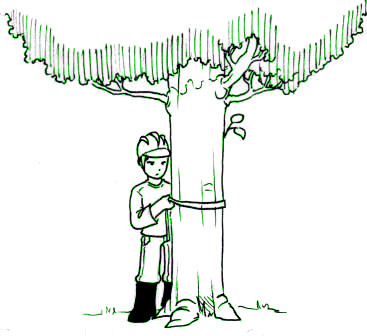
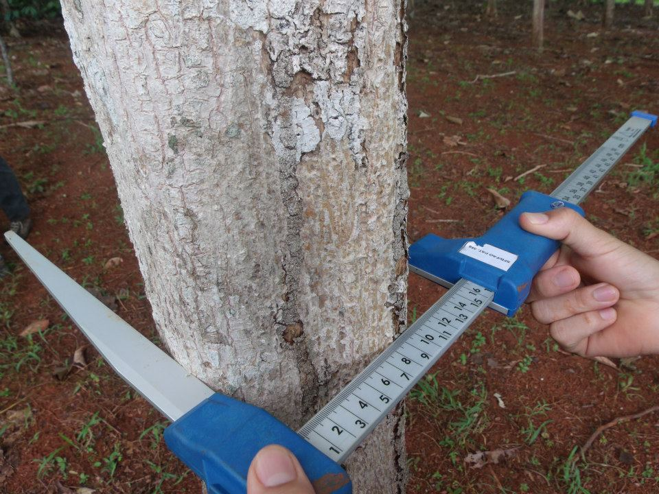
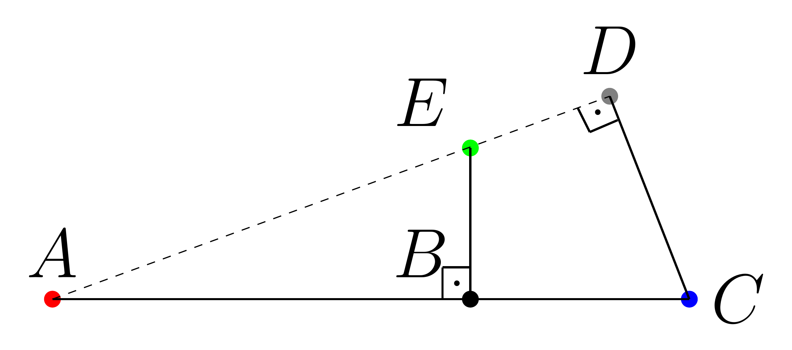
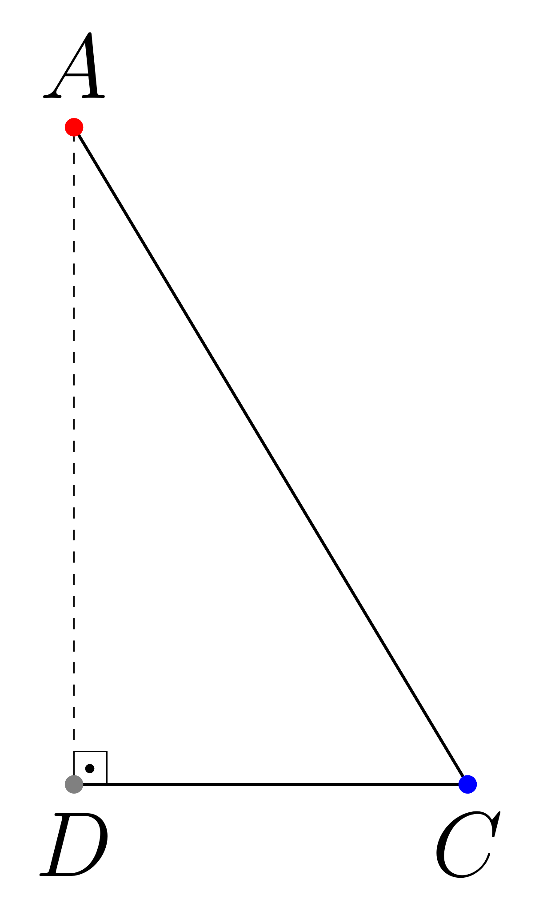
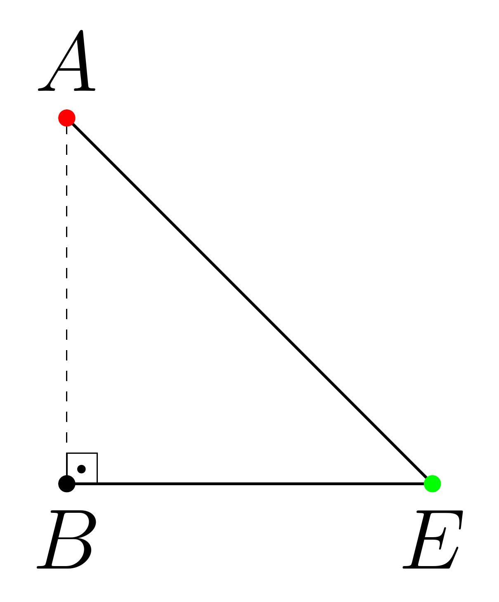
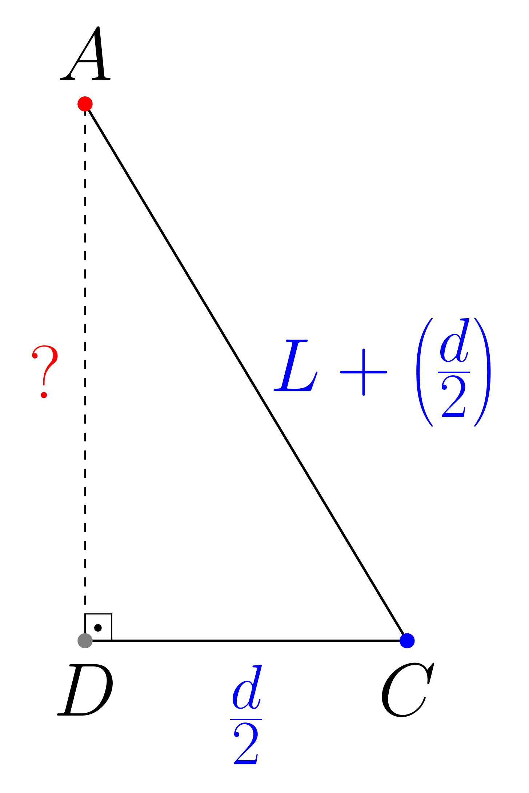
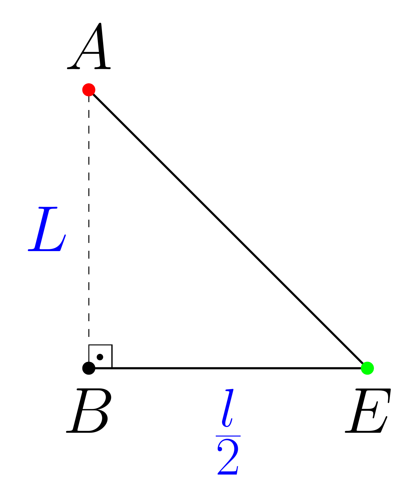
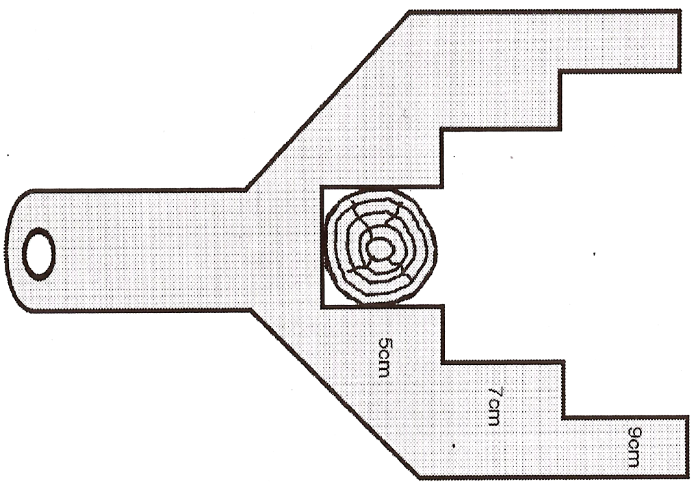
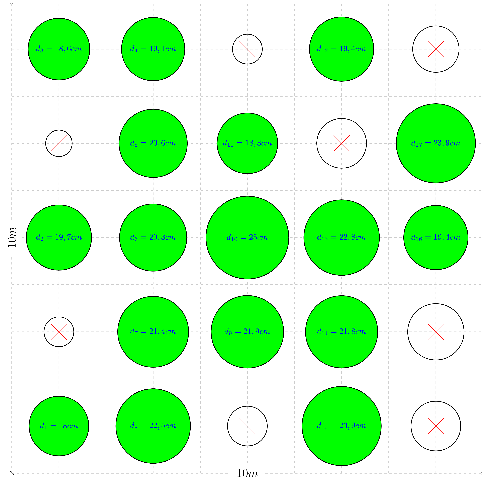

class: title-slide, center, middle
background-image: url(fig/slide-title/ufpa2.png), url(fig/slide-title/forest.png), url(fig/slide-title/img3.png)
background-position: 84% 90%, 95% 90%
background-size: 220px, 90px, cover

```{r setup, include=FALSE}
knitr::opts_chunk$set(
  fig.showtext = TRUE,
  fig.align = "center", 
  cache = FALSE, 
  error = FALSE,
  message = FALSE, 
  warning = FALSE, 
  collapse = TRUE ,
  dpi = 600)
```

```{r packages, include=FALSE}
# remotes::install_github("dill/emoGG")
library(ggplot2)
library(dplyr)
library(ggimage)
```

```{r xaringan-logo, echo=FALSE}
library(xaringanExtra)
use_logo(
  image_url = "fig/slide-title/ufpa.png",
  position = css_position(top = ".8em", right = "-.5em"),
  width = "140px",
  height = "140px"
)
```

```{r customDT, echo=F}
CustomDT <- function(data){
  data %>% DT::datatable(editable = 'cell', rownames = FALSE,
                         style = "default",
                         class = "display", width = '180px',
                         caption = '',
     options=list(pageLength = 20, dom = 't', autoWidth = F,
       initComplete = htmlwidgets::JS(
          "function(settings, json) {",
          paste0("$(this.api().table().container()).css({'font-size': '", "9pt", "'});"),
          "}")
       ) 
     )
}
```

```{r icon, echo=FALSE}
#remotes::install_github("mitchelloharawild/icons")
#library(icons)
#download_fontawesome()
#download_simple_icons()
```

<!-- title-slide -->
# Dendrometria <br> (FL03029)
<br>
## `r anicon::faa("pagelines", animate="horizontal", colour="green")` Medição de Diâmetros <br> de Árvores `r anicon::faa("pagelines", animate="horizontal", colour="green")`

#### **Prof. Dr. Deivison Venicio Souza**
##### Universidade Federal do Pará (UFPA) 
##### Faculdade de Engenharia Florestal
##### E-mail: deivisonvs@ufpa.br
<br>
##### 1ª versão: 25/janeiro/2022 <br> (Atualizado em: `r format(Sys.Date(),"%d/%B/%Y")`) <br> Altamira, Pará

---
layout: true
<div class="my-header"></div>
<div class="my-footer"><span>Prof. Dr. Deivison Venicio Souza (E-mail: deivisonvs@ufpa.br)&emsp;&emsp;&emsp;&emsp;&emsp;Dendrometria (FL03029) - Medição de Diâmetros de Árvores</div>

---

## Ementa da disciplina (FL03039 - IF)
<br>

.pull-left-3[
.shadow3[
1 - Introdução à Dendrometria

**2 - Medição de Diâmetros de Árvores**

3 - Medição de Alturas de Árvores

4 - Relação Hipsométrica

5 - Estudo da Forma do Tronco das Árvores

6 - Volume de Árvores (Métodos de Cubagem)

7 - Método de Bitterlich - Relascopia 

8 - Biomassa e Carbono de Árvores
]
]

---

## Objetivos
<br><br>
Ao final desta aula espera-se que o discente seja capaz de...

* Compreender a importância da medição do diâmetro de árvores, bem como a necessidade de padronização de pontos de medição;
* Compreender sobre situações especiais de pontos de medição de diâmetros;
* Conhecer os principais instrumentos para a medição de diâmetros;
* Conhecer os principais erros que podem ocorrer na medição de diâmetros, bem como entender como evitá-los (ou minimizá-los);
* Compreender a relação entre diâmetro x área tranversal e área basal do povoamento florestal; e
* Conhecer as principais estatísticas associadas ao diâmetro da árvore.

---

## Conteúdo

.pull-left[
.pull-top[
**Parte 1 - O Diâmetro das Árvores**
.font80[

[1 - Importância do Diâmetro](#id)

[2 - Ponto de Medição do Diâmetro - PMD](#pmd)

[3 - Relação entre Diâmetro e Circunferência](#rdc)

[4 - Situações Especiais de PMD](#sepmd)

&nbsp;&nbsp;[4.1 - Árvores sem anomalias e situadas em terreno plano](#asa)

&nbsp;&nbsp;[4.2 - Árvores inclinadas](#ai)

&nbsp;&nbsp;[4.3 - Árvores em aclives ou declives](#aad)

&nbsp;&nbsp;[4.4 - Árvores bifurcadas abaixo de 1,30 m do solo](#ab)

&nbsp;&nbsp;[4.5 - Árvores bifurcadas acima de 1,30 m do solo](#aba)

&nbsp;&nbsp;[4.6 - Árvores com sapopemas ou raízes aéreas](#asra)

]
]
]


.pull-right[
.pull-top[
**Parte 2 - Instrumentos para a Medição de Diâmetros**
.font80[
[1 - Suta (Mecânica e Eletrônica)](#sme)

[2 - Fita Diamétrica](#fd)

[3 - Régua de Biltmore](#vb)

[4 - Garfo de Diâmetro](#gd)

[5 - Cinta Dendrométrica](#cd)

]
]

.pull-bottom[
<br>
**Parte 3 - Medidas Derivadas do Diâmetro**
.font80[
[1 - Relação Diâmetro e Área Transversal](#rdat)

[2 - Relação Diâmetro e Área Basal](#rdab)
]
]
]


---

## Conteúdo (Cont.)

.pull-left[
.pull-top[
<br>
**Parte 4 - Erros na Medição de Diâmetros**
.font80[
[1 - Erros no Uso da Suta](#eus)

[2 - Erro da Área Transversal Devido ao Desvio da Forma do Círculo](#eat)

]
]

.pull-bottom[
<br>
**Parte 5 - Estatísticas Associadas ao Diâmetro**
.font80[
[1 - Média aritmética](#ma)

[2 - Diâmetro médio (ou Média quadrática)](#dm)

[3 - Diâmetro equivalente - $d_{eq}$](#deq)
]
]
]


<!-- Slide XX -->
---
layout: false
class: inverse, middle, center
background-image: url(fig/class1/sec.png)
background-size: cover

.white[.font200[**Diâmetro das Árvores:**] <br> .font150[Importância, Ponto de Medição, Situações Especiais]]

---
layout: true
<div class="my-header"></div>
<div class="my-footer"><span>Prof. Dr. Deivison Venicio Souza (E-mail: deivisonvs@ufpa.br)&emsp;&emsp;&emsp;&emsp;&emsp;Dendrometria (FL03029) - Medição de Diâmetros de Árvores/Parte 1: O Diâmetro das Árvores</div>

---
name: id
## Diâmetro das Árvores: Importância
<br>

.shadow1[
### Importância do Diâmetro
<br>
**1)** O diâmetro da árvore é importante para o cálculo de diversas medidas derivadas:
 * a) Cálculo da área transversal (g) da árvore;

$$
\begin{equation*}
\large
 g_i = \frac{\pi \color{blue}{d}^2}{4}
\end{equation*}
$$
 * b) Cálculo da área basal (G) da parcela/unidade de amostra (ou população);
$$
\begin{equation*}
G = \sum_{i=1}^{n}g_i
\end{equation*}
$$

]


---

## Diâmetro das Árvores: Importância
--

.shadow1[
### Importância do Diâmetro
<br>
.font90[
**1)** O diâmetro da árvore é importante para o cálculo de diversas medidas derivadas:
 * c) Cálculo do volume da árvore individual; (Por exemplo, a fórmula para calcular o volume de árvores individuais em PMFS na Amazônia)

$$
\begin{equation*}
\large
 v_i = \frac{\pi \color{blue}{d}^2}{4}.h_{c}.0,7~~\color{orange}{(Eq. 1)}~~~~~~~~~~
 v_i = \frac{\pi \color{blue}{d}^2}{40000}.h_{c}.0,7~~\color{darkred}{(Eq. 2)}~~
\end{equation*}
$$

$\color{orange}{Eq. 1}$: $d$ = diâmetro medido à 1,30m do solo (**em metros**); $h_c$ = altura comercial da árvore (em metros); $0,7$ = fator de forma

$\color{darkred}{Eq. 2}$: $d$ = diâmetro medido à 1,30m do solo (**em centímetros**); $h_c$ = altura comercial da árvore (em metros); $0,7$ = fator de forma
]
]

.font90[
**Importante** `r anicon::faa("exclamation-triangle", colour="red")`: Veja que o diâmetro tem .blue[efeito quadrático sobre o volume] da árvore.
]

---

## Diâmetro das Árvores: Importância

.shadow1[
### Importância do Diâmetro
<br>
.font90[
**1)** O diâmetro da árvore é importante para o cálculo de diversas medidas derivadas:
 * d) Cálculo do crescimento (ou incremento) da árvore (ICA, IMA, IP, IPA);

$$
\begin{equation*}
\large
 ICA = Y_2 - Y_1~~~~~~~~~~~~
 IPA = \frac{Y_2 - Y_1}{t} ~~~~~~~~~~~~
 IMA = \frac{Y}{I}
\end{equation*}
$$

**Em que**: ICA = Incremento Corrente Anual; IMA = Incremento Médio Anual; IP = Incremento Periódico; IPA = Incremento Periódico Anual (IPA).
<br><br>

`r anicon::faa("hand-point-right", animate="horizontal", colour="blue")` Comumente, o crescimento (incremento) em volume é de maior interesse.
<br>
`r anicon::faa("hand-point-right", animate="horizontal")` **Lembre-se:** Precisa-se do diâmetro para calcular o volume da árvore!


`r anicon::faa("hand-point-right", animate="horizontal", colour="orange")` **Entenda as definições**: [SOARES et al., 2011](http://www.mensuracaoflorestal.com.br/crescimento-e-producao-florestal)

]
]

---

## Diâmetro das Árvores: Importância

.shadow1[
### Importância do Diâmetro
<br>
.font90[
**1)** O diâmetro da árvore é importante para o cálculo de diversas medidas derivadas:
 * e) Quociente de forma (K) e fator de forma (f);

$$
\begin{equation*}
\large
 K = \frac{d_{\frac{1}{2}h}}{d}~~~~~~~~~~~~~
 f_{1,3} = \frac{v_{cubagem}}{v_{cilindro}}
\end{equation*}
$$
<br>
]

.font80[
$K$ = Quociente de forma artificial (ou Schiffel); 

$f_{1,3}$ = Fator de Forma Normal ou Artificial

$d_{\frac{1}{2}h}$: Diâmetro medido na metade da altura da árvore.

$d$: diâmetro medido à 1,30 m do solo.

`r anicon::faa("hand-point-right", animate="horizontal")` **Importante:** Existem outras variações para determinação do quociente e fator de forma.

]
]


---

## Diâmetro das Árvores: Importância

.shadow1[
### Importância do Diâmetro
<br>
.font80[
**2)** Usado para compreender a distribuição diamétrica de espécies e/ou florestas (nativas ou plantadas);
]
]

--

.pull-left-2[
```{r tb1, echo=F, eval=T, dpi=600, fig.width=1, fig.height=.6}
library(dplyr)
library(ggplot2)
library(plotly)

data <- readr::read_csv("Data/UPA07DVS.csv") %>% 
  mutate(DAP = CAP/pi)

# Gráfico de distribuição diamétrica 
h1 <- data %>%
  filter(Nome_Especie %in% "Acapu") %>%
  ggplot(aes(x=DAP)) +
  geom_histogram(breaks=seq(30, 120, by=10),
                 col="red",
                 fill="green",
                 alpha = .2) +
  labs(title = "Distribuição Diamétrica \n(Vouacapoua americana Aubl.)",
       subtitle = "") +
  scale_x_continuous(breaks=seq(30, 120, by=10),
                     limits=c(30, 120),
                     name="Classes de Diâmetro") +
  scale_y_continuous(breaks=seq(0, 1000, by=100),
                     limits=c(0, 1000),
                     name="Número de Indivíduos") +
  theme_bw() +
  theme(panel.border=element_rect(color="black"),
        plot.title = element_text(hjust = 0),
        plot.subtitle = element_text(hjust = 0.5, face = 'italic'))


p_h1 <- ggplot_build(h1)

h1 <- ggplotly(h1)
  
  mytext_h1 <- paste("Count", ": ", p_h1$data[[1]]$count, "\n",
                    "Lower",": ", round(p_h1$data[[1]]$xmin,2), "\n",
                    "Mids",": ", round(p_h1$data[[1]]$x,2), "\n",
                    "Upper",": ", round(p_h1$data[[1]]$xmax,2), sep="")
  
h1 <- plotly_build(h1)
style(h1, text=mytext_h1, hoverinfo="text",traces=c(1,2,3,4))

```

]

<br><br><br><br>
.pull-right-1[
.font80[
**Fonte**: IF-100% da UPA-07 da AMF do PDS-Virola Jatobá.
]
]

---

## Diâmetro das Árvores: Importância

.shadow1a[
### Importância do Diâmetro
<br>

**3)** Usado como variável independente (preditora) no ajuste de modelos preditivos;
.font90[
- a) Modelos volumétricos $\rightarrow$ $ln(v) = ln(\beta_0) + \beta_1ln(\color{blue}{d}) + \beta_2ln(h_c) + \epsilon_i$ (.green[Schumacher-Hall])
- b) Modelos hipsométricos $\rightarrow$ $h = \beta_0 + \beta_1\frac{1}{\color{blue}{d}} + \epsilon_i$ (.green[Curtis, 1967])
- c) Modelos de biomassa $\rightarrow$ $ln(AGB) = \beta_0 + \beta_1ln(\rho \color{blue}{d}^2h) + \epsilon_i$ (.green[Chaves et al., 2014])*
- d) Modelos de carbono
- e) Modelos de fator de forma
- f) Modelos de afilamento do fuste
- g) Modelos de aprendizado de máquina (RNA, Random Forest, SVR, Regression Tree, etc.)
]

]

`r anicon::faa("hand-point-right", animate="horizontal", colour="orange")` **Acesse**: [Chaves et al., 2014](https://onlinelibrary.wiley.com/doi/10.1111/gcb.12629)

---
name: pmd
## Ponto de Medição do Diâmetro - PMD

.shadow1[
### A Necessidade de Padronizar de um Ponto de Medição
.font90[
- Até início do século XX as .blue[medições] de diâmetro eram tomadas em .blue[diferentes alturas] próxima da base;
- Devido a isso, não era possível .blue[comparar os estudos] conduzidas por diferentes pesquisadores de distintos locais;
- Assim, surgiu a necessidade de padronizar um .blue[Ponto de Medição do Diâmetro (PMD)];
- Portanto, convencionou-se que a altura mais adequada para a medição do diâmetro a .blue[1,30m do solo]. Essa medida foi comumente denominada: **Diâmetro à Altura do Peito (DAP)**

(**Machado e Figueiredo Filho, 2009**)
]
]

<br>

.font80[
**Minha opinião** `r anicon::faa("exclamation-triangle", colour="red")`: Não concordo com o uso da terminologia **Diâmetro à Altura do Peito (DAP)**. Particularmente, acredito ser mais razoável usar **Diâmetro à 1,30m do solo**, e simbolizar por $d$, conforme recomendado pela IUFRO.
]

---

## Ponto de Medição do Diâmetro - PMD

.font90[
.shadow1[
### Por que 1,30m do solo?
<br>
As principais razões para a escolha da altura de 1,30m do solo foram: (SILVA; PAULA NETO,1979; MACHADO; FIGUEIREDO FILHO, 2009)

- **Altura do operador**: Padronizar um PMD que não tivesse uma dependência da altura do operador;
- **Manuseio do instrumento**: Na altura de 1,30m do solo, o instrumento é facilmente manejável; e
- **Sapopemas ou raízes aéreas**: Evitar a influência de sapopemas ou raízes aéreas muito comuns em florestas tropicais.
]
]
<br>

.font80[
`r anicon::faa("hand-point-right", animate="horizontal", colour="orange")` **Na Amazônia**: é bastante comum encontrar árvores com sapopemas gigantes, maiores do que 1,30m do solo.
]

---

## Ponto de Medição do Diâmetro - PMD

.font90[
.shadow1[
### Ainda existem diferenças no PMD...
<br>
Apesar da padronização da altura do ponto de medição ainda existem pequenas diferenças entre países: (Machado e Figueiredo Filho, 2009)
<br><br>

.pull-left-4[
| **País**       | **Altura do PMD (m)** |
|:---------------:|:----------------------:|
| Brasil         | 1,30                  |
| Estados Unidos | 1,35                  |
| Japão          | 1,25                  |
| Inglaterra     | 1,39                  |

<br>

`r anicon::faa("hand-point-right", animate="horizontal", colour="orange")` **Implicações**: gera pequenas diferenças na medida do DAP e, por conseguinte, da área transversal entre países.
]

.pull-right-4[
```{r, echo=FALSE, out.width='75%', fig.align='center', fig.cap='', dpi=600}

```
]

]
]

---
name: rdc
## Relação entre Circunferência e Diâmetro
<br>
.font90[
.shadow1[
### Conversão Circunferência e Diâmetro
<br>
- Em muitos casos, a medida do diâmetro não pode ser obtida diretamente, seja pela .blue[ausência de instrumento] de medição graduado com medidas de diâmetro (por exemplo, fita diamétrica), seja pela .blue[dimensão das árvores];
- Alternativamente, pode-se .blue[medir a circuferência] da árvore com uma fita métrica convencional; e
- Assim, como o comprimento e diâmetro da circunferência guardam uma relação matemática, pode-se realizar uma simples conversão por fórmula.

]
]

---

## Relação entre Circunferência e Diâmetro

.pull-left-1[
```{r, echo=FALSE, out.width='95%', fig.align='center', fig.cap='', dpi=600}
knitr::include_graphics('fig/class2/dc.png')
```

.font80[
Em que: $\pi$ = constante pi (3,141593); $r$ = raio da circunferência; $c$ = comprimento da circunferência; $d$ = diâmetro da circunferência.
]
]

--

.pull-right-2[
<br>
.center[**Relação matemática...**]

$$
\Large
\begin{equation*}
c = \pi d~~~~~~~~~~~~~~ d = \frac{c}{\pi}
\end{equation*}
$$

.font90[
**Exemplo**: Considere que a medida da circuferência tomada à 1,30m do solo de uma árvore é 157,08cm. Qual o valor do diâmetro, em centímetros, dessa árvore?
]
<br>

$$
\Large
\begin{equation*}
d = \frac{c}{\pi} = \frac{157,08}{3,141593} \approx 50cm
\end{equation*}
$$


]


---
name: sepmd
## Situações Especiais de PMD

.shadow1[
### Situações Especiais
<br>
Em situações práticas de campo, .blue[nem sempre é possível medir o diâmetro a 1,30 m do solo]. Portanto, o PMD pode modificar em função de(a):

- a) Anomalias na árvore (bifurcações, nó, dilatação, etc.);
- b) Inclinação da árvore;
- c) Localização no terreno (aclives ou declives); e
- d) Presença de sapopemas ou raízes aéreas.

]

---
name: asa
## Situações Especiais de PMD

.pull-left-4[
.font80[
<br>
1 - Árvores sem anomalias no PMD e situadas em terreno plano

2 - Árvores em declives (ou aclives)

3 - Árvores inclinadas e em declives

4 - Árvores com galhos/deformidades no PMD

5 - Árvores bifurcadas abaixo do PMD

6 - Árvores bifurcadas acima do PMD

7 - Árvores com sapopemas

8 - Árvores com raízes elevadas (raízes aéreas)
<br><br>

**Importante** `r anicon::faa("exclamation-triangle", colour="red")`: Para árvores com sapopemas ou raízes aéreas maiores do que 1,30m, recomenda-se definir o PMD 30cm após o término da anomalia (Machado; Figueiredo Filho, 2009).

]
]


.pull-right-4[
```{r, echo=FALSE, out.width='70%', fig.align='center', fig.cap='', dpi=600}
knitr::include_graphics('https://www.researchgate.net/profile/Bao-Huy-2/publication/317380319/figure/fig4/AS:502540039344129@1496826290207/Measuring-DBH-tree.png')
```

.center[
.font70[
Huy et al. (2013). [(Link para Versão Web)](https://www.researchgate.net/profile/Bao-Huy-2/publication/317380319_Participatory_Carbon_Monitoring_Manual_for_Local_Technical_Staff/links/5937c1adaca272ede1cefd8a/Participatory-Carbon-Monitoring-Manual-for-Local-Technical-Staff.pdf)
]
]
]

---

## Situações Especiais de PMD
<br>
### **Algumas situações em campo...**

.pull-left-4[
```{r, echo=FALSE, out.width='45%', fig.align='center', fig.cap='', dpi=600}
knitr::include_graphics('https://i.stack.imgur.com/rc3Lc.jpg')
```

.center[.font80[**Fonte**: [stackexchange.com](https://outdoors.stackexchange.com/questions/9800/what-are-these-bulges-are-they-harming-the-tree)]]

]

.pull-left-4[

```{r, echo=FALSE, out.width='75%', fig.align='center', fig.cap='Samaúma (Ceiba pentranda) ', dpi=600}
knitr::include_graphics('https://portalamazonia.com/images/p/34367/samauma.jpg')
```
.center[.font80[**Fonte**: [portalamazonia.com](https://portalamazonia.com/images/p/34367/samauma.jpg)]]
]

<!-- Slide XX -->
---
layout: false
class: inverse, middle, center
background-image: url(fig/class1/sec.png)
background-size: cover

.white[.font200[**Instrumentos para a Medição de Diâmetros:**] <br> .font150[Suta, Fita Diamétrica, Vara de Biltmore, etc.]]

---
layout: true
<div class="my-header"></div>
<div class="my-footer"><span>Prof. Dr. Deivison Venicio Souza (E-mail: deivisonvs@ufpa.br)&emsp;&emsp;&emsp;&emsp;&emsp;Dendrometria (FL03029) - Medição de Diâmetros de Árvores/Parte 2: Instrumentos para a Medição de Diâmetros</div>

---
name: sme
## Instrumentos para a Medição de Diâmetros

.shadow1[
### Suta - Características
<br>

**Sinonímia**: Cálibre, forcípula ou compasso florestal.

**Manuseio**: Simples, fácil.

----------

**Composição**:

1 - Régua graduada

2 - Dois braços perpendiculares à régua

- **Braço fixo** (coincide com "zero");
- **Braço móvel** (desloca-se sobre a régua graduada).

]

---

## Instrumentos para a Medição de Diâmetros

.shadow1[
### Suta - Características
]
<br>

.pull-left-4[
.center[**MADEIRA**]
.font80[
- **No início**: o principal material usado foi a madeira.
- **Vantagens**: leves e baratas.
- **Desvantagens**: 
1. Desgaste do encaixe do braço móvel; e
2. Suscetíveis às variações de umidade.
]
<br><br><br><br>
.green[**É um paquímetro para medir grandes dimensões!**]
]

--

.pull-right-4[
.center[**LIGAS DE ALUMÍNIO**]
.font80[
- **Atualmente**: Ligas de alumínio
- **Vantagens**:
  1 - Leves;
  2 - Mantém-se ajustadas por maior tempo; e
  3 - Maior facilidade de limpeza do instrumento.
- **Desvantagens**: 
1. Mais caras! 

`r anicon::faa("hand-point-right", animate="horizontal", colour="orange")` Embora não tenha conhecimento de valores das sutas de madeira, é razoável acreditar que as sutas de ligas de alumínio tiveram uma agregação de valor.
]
]

---

## Instrumentos para a Medição de Diâmetros

.shadow1[
### Suta - Tipos
]
<br>
.pull-top[
.pull-left-4[
```{r, echo=FALSE, out.width='70%', fig.align='center', fig.cap='Suta Mecânica', dpi=600}
knitr::include_graphics('https://www.eloforte.com/uploads/01.jpg')
```
.center[.font80[**Fonte**: [www.eloforte.com](https://www.eloforte.com/uploads/01.jpg)]]
]

.pull-left-4[
```{r, echo=FALSE, out.width='70%', fig.align='center', fig.cap='Suta Digital (Suta Mantax Digitech MDII)', dpi=600}
knitr::include_graphics('https://www.eloforte.com/uploads/04.jpg')
```
.center[.font80[**Fonte**:[www.eloforte.com](https://www.eloforte.com/uploads/04.jpg)]]

.font70[
Acesse o site [https://www.eloforte.com](https://www.eloforte.com) e veja outros modelos de Suta e acessórios (como apontadores a laser GatorEyes para medir diâmetros à distância).
]
]
]


---

## Instrumentos para a Medição de Diâmetros

.pull-left-9[
<br>
.shadow1[
### Suta Mecânica - Procedimento de uso

.font80[
- 1- Abrir o braço móvel;
- 2 - Encostar a régua graduada na árvore;
- 3 - Comprimir os braços contra o tronco da árvore;
- 4 - Manter os braços e a régua no mesmo plano horizontal; e
- 5 - Ler a medida do diâmetro diretamente na régua graduada.

]
]
<br>
.font90[
Atenção `r anicon::faa("exclamation-triangle", colour="red")`: Não pressionar demasiadamente o braço da Suta contra a casca. Pode acarretar erro de medição.
]
]

.pull-right-9[
<br><br>
```{r, echo=FALSE, out.width='90%', fig.align='center', fig.cap='', dpi=600}

```
<br>

.font80[**Foto**: Acervo pessoal.]
]

---

## Instrumentos para a Medição de Diâmetros

.shadow1[
### Suta Mecânica - Procedimento de uso
<br>
**Recomendação**: Para árvores com seções não circulares recomenda-se tomar 2 medições. Em seguida, calcula-se a média aritmética.

$$
\Large
\begin{equation*}
d = \frac{d_1 + d_2}{2}
\end{equation*}
$$
]


---

## Instrumentos para a Medição de Diâmetros

.shadow1[
### Suta - Desvantagens
<br>
.font90[
- **1. Imprecisão**: Quando desajustado (erros sistemáticos);
- **2. Árvores Grossas**: Sutas muito grandes (transporte e manuseio);
- **3. Resíduos**: Na barra graduada (deslizamento do braço móvel); e
- **4. Árvores Excêntricas**: Necessidade de tomar 2 medidas.

]
]


---

## Instrumentos para a Medição de Diâmetros
<br>
.pull-left-9[
.shadow1[
### Fita Diamétrica
<br>
.font90[
- É uma fita graduada em intervalos constantes de $\pi$ em uma de suas faces. 
- Ao usar a fita diamétrica pode-se obter diretamente a medida do diâmetro da árvore, em centímetros.
]
]
]

--

.pull-right-9[
<br>
```{r, echo=FALSE, out.width='90%', fig.align='center', fig.cap='Fita Diamétrica', dpi=600}
knitr::include_graphics('https://www.embrapa.br/bme_images/m/190480040m.jpg')
```
.center[.font80[**Fonte**: [https://www.embrapa.br](https://www.embrapa.br/bme_images/m/190480040m.jpg)]]
]


---

## Instrumentos para a Medição de Diâmetros

.pull-left-2[
.shadow1[
### Fita Diamétrica - Características
.font80[
**Manuseio**: Simples, fácil.

----------

**Composição**:

1 - Duas Faces
- **Face 1**: Leitura de diâmetros, em cm. $(d = \dfrac{c}{\pi})$
- **Face 2**: Leitura de circunferências, em cm.

2 - Gancho na extremidade (algumas)

3 - Comprimento (5 ou 10m)

----------

**Material**:

1 - Aço flexível

2 - Lona reforçada
]
]
]

--

.pull-right-1[
<br>
```{r, echo=FALSE, out.width='95%', fig.align='center', fig.cap='Fita Diamétrica', dpi=600}
knitr::include_graphics('https://terrages.pt/media/img/FitasDiametricas.png')
```
.center[.font80[**Fonte**: [https://terrages.pt](https://terrages.pt/media/img/FitasDiametricas.png)]]
]

---

## Instrumentos para a Medição de Diâmetros

.shadow1[
### Fita Diamétrica vs Fita Métrica
<br>
.font90[
- **Relação**: Uma unidade de diâmetro ( $d$ ) equivale a 3,141593 ( $\pi$ ) unidades de circunferência ( $c$ ).
- **Evidência matemática**: Dada a circunferência de indivíduo igual a 3,141593cm, então seu diâmetro será:
<br><br>

$$
\Large
\begin{equation*}
d = \frac{3,141593}{\pi} = \frac{3,141593}{3,141593} \approx 1cm
\end{equation*}
$$

-------------
<br>
🌳**.green[Atividade prática 1 (individual)]**🌳: Construir uma **Fita Diamétrica**.
]
]

---

## Instrumentos para a Medição de Diâmetros

.shadow1[
### Fita Diamétrica - Procedimento de uso

.font90[
- 1 - A fita deve circundar o tronco em posição horizontal.
- 2 - Cuidar para evitar dobraduras na fita, no momento da medição.
]
]

.pull-left-4[
```{r, echo=FALSE, out.width='65%', fig.align='center', fig.cap='', dpi=600}

```
]


---

## Instrumentos para a Medição de Diâmetros

.shadow1[
### Comparação: Suta x Fita diamétrica
]
<br>

.font90[
| **Fatores**                                         | **Suta**                          | **Fita Diamétrica**               |
|:---------------------------------------------------:|:---------------------------------:|:---------------------------------:|
| Transporte                                          | Menos Cômodo (tamanho)            | Mais cômodo (bolso)               |
| Tempo de Medição                                    | + Rápido                          | + Vagarosa                        |
| Diâmetro                                            | Sim                               | Sim                               |
| Circunferência                                      | Não                               | Sim                               |
| Seções Excêntricas (Elípiticas) - Número de Medidas | 2                                 | 1                                 |
| Seções Excêntricas (Elípiticas) - Erros de Medidas   | Sistemáticos para + (< magnitude) | Sistemáticos para + (> magnitude) |
]


---
name: vb
## Instrumentos para a Medição de Diâmetros

.pull-left-2[
.shadow1[
### Régua de Biltmore - Características
<br>
.font80[
**Sinonímia**: Vara de Biltmore

**Inglês**: Biltmore stick

**Manuseio**: Simples, fácil, pode construir em casa

**Material**: Madeira

**Utilidade**: Medir diâmetro de árvore em pé

----------

**Dimensões**:

- .blue[Comprimento]: Variável (Média: 70cm)
- .blue[Largura]: 2 ou 3 centímetro
- .blue[Espessura]: 1 centímetro
]
]
]

.pull-right-1[
<br><br><br><br>
```{r, echo=FALSE, out.width='95%', fig.align='center', fig.cap='Biltmore stick', dpi=600}
knitr::include_graphics('https://bloximages.chicago2.vip.townnews.com/heraldbulletin.com/content/tncms/assets/v3/editorial/9/e8/9e8d43ed-5fef-54e6-8f7d-febb92f9c685/5418eeab359e5.image.jpg')
```

.center[.font80[**Fonte**: [https://bloximages.chicago2](https://bloximages.chicago2.vip.townnews.com/heraldbulletin.com/content/tncms/assets/v3/editorial/9/e8/9e8d43ed-5fef-54e6-8f7d-febb92f9c685/5418eeab359e5.image.jpg)]]

]

---

## Instrumentos para a Medição de Diâmetros

.pull-left-2[
.shadow1[
### Régua de Biltmore - Procedimento de Uso
.font80[
- Encostar a régua no tronco, em posição perpendicular ao eixo da árvore;
- Manter a cabeça imóvel e com ".blue[olho]" a uma distância ".blue[L]" pré-fixada;
- **1ª visada**: Deslocar a vara até que a marca ".blue[zero]" coincida com a linha de vista que tangencia um lado da árvore; e
- **2ª visada**: Fornecerá a leitura do diâmetro da árvore. É o ponto em que a linha de visada tangencia a outra extremidade da árvore.
]
]
]

.pull-right-1[
```{r, echo=FALSE, out.width='95%', fig.align='center', fig.cap='', dpi=600}
knitr::include_graphics('https://extension.unh.edu/sites/default/files/migrated_unmanaged_files/diameteroftree.png')
```

.center[.font80[**Fonte**: [https://extension.unh.edu](https://extension.unh.edu/sites/default/files/migrated_unmanaged_files/diameteroftree.png)]]
]


---

## Instrumentos para a Medição de Diâmetros

.shadow1[
### Régua de Biltmore - Procedimento de Uso
<br>
.font80[
Três condições básicas são indispensáveis para o perfeito uso da Régua de Biltmore (SILVA; PAULA NETO, 1979; MACHADO; FIGUEIREDO FILHO, 2009):

- 1) O operador tenha sua vista colocada a uma distância ".blue[L]" da Régua, previamente determinada; [Brasil (L = 50 e 60 cm)]. Preferencialmente, o ".blue[L]" deve ser no máximo igual ao comprimento do braço do operador;
- 2) A Régua esteja perpendicular ao eixo da árvore no momento da leitura do diâmetro; e
- 3) O plano definido pela Régua e pela vista do observador seja perpendicular ao eixo da árvore.

]
]

---

## Instrumentos para a Medição de Diâmetros

.shadow1[
### Régua de Biltmore - Princípio geométrico para a graduação
]

.pull-left-9[
```{r, echo=FALSE, out.width='85%', fig.align='center', fig.cap='Princípio geométrico', dpi=600}
knitr::include_graphics('fig/class2/bilt.png')
```
.font70[
**Fonte**: O autor.

O círculo da figura representa a área da seção transversal da árvore no ponto de medição do diâmetro, cujo centro é "C".
]
]

--

.pull-right-9[
.center[**Notações**]
.font80[
- **A**  → Posição do olho do observador;
- **EBF** → Régua de Biltmore, encostada à árvore, tangenciando a marca "zero" de um lado e o diâmetro da árvore no lado oposto;
- **AED** → Linha de visada tangenciando a marca "zero";
- **AFG** → Linha de visada tangenciando a graduação do diâmetro;
- **AB** → Distância do observador à árvore ( $L$ );
- **BC** e **DC** → Raios da circunferência; e
- **EF** → Comprimento ( $l$ ) na régua.
]
]

---

## Instrumentos para a Medição de Diâmetros

.shadow1[
### Régua de Biltmore - Princípio geométrico para a graduação
]

.pull-left-9[
```{r, echo=FALSE, out.width='85%', fig.align='center', fig.cap='Princípio geométrico', dpi=600}
knitr::include_graphics('fig/class2/bilt.png')
```
.font70[**Fonte**: O autor.]
]

--

.pull-right-9[
.center[**Triângulos retângulos**]
.font80[

- O comprimento $l$ se relaciona com o diâmetro $d$, desde que a seção transversal da árvore seja circular;
- Os triângulos ABE~ACD → Formam dois triângulos retângulos e semelhantes.

```{r, echo=FALSE, out.width='85%', fig.align='center', fig.cap='Semelhança de triângulos', dpi=600}

```
.font70[**Fonte**: O autor.]

]
]

---

## Instrumentos para a Medição de Diâmetros

.shadow1[
### Régua de Biltmore - Princípio geométrico para a graduação
]

.pull-left-8[
.center[**Semelhança de Triângulos Retângulos**]
.font80[

```{r, echo=FALSE, out.width='95%', fig.align='center', fig.cap='', dpi=600}

```
.font80[**Fonte**: O autor.]

]
]

--

.pull-left-6[

```{r, echo=FALSE, out.width='60%', fig.align='center', fig.cap='', dpi=600}

```

]

--

.pull-left-6[
<br><br>
```{r, echo=FALSE, out.width='70%', fig.align='center', fig.cap='', dpi=600}

```

]

--


.pull-bottom[
.pull-left-5[
$$
\begin{equation*}
L = \overline{AB}\\
l = \overline{EF} = 2\overline{BE}\\
d = 2\overline{DC} = 2\overline{BC}
\end{equation*}
$$
]

.pull-right-5[

$L$ = Distância do observador à árvore

$l$ = Comprimento na régua

$d$ = diâmetro da árvores
]
]

---

## Instrumentos para a Medição de Diâmetros

.shadow1[
### Régua de Biltmore - Princípio geométrico para a graduação
]

.pull-left-8[
.center[**Semelhança de Triângulos Retângulos**]
.font80[

```{r, echo=FALSE, out.width='95%', fig.align='center', fig.cap='', dpi=600}

```
.font80[**Fonte**: O autor.]

]
]

--

.pull-left-6[

```{r, echo=FALSE, out.width='75%', fig.align='center', fig.cap='', dpi=600}

```

]

--

.pull-left-6[
<br><br>
```{r, echo=FALSE, out.width='75%', fig.align='center', fig.cap='', dpi=600}

```

]

.font80[
Portanto, a fórmula para graduação da Régua de Biltmore originou-se do princípio de semelhança entre triângulos retângulos.
]

<br><br><br><br>
$$
\begin{equation*}
\dfrac{\overline{BE}}{\overline{AB}} = \dfrac{\overline{DC}}{\overline{AD}}\Rightarrow
\dfrac{\dfrac{l}{2}}{L} = \dfrac{\dfrac{d}{2}}{\overline{AD}}
\end{equation*}
$$


---

## Instrumentos para a Medição de Diâmetros

.shadow1[
### Régua de Biltmore - Princípio geométrico para a graduação
]

.pull-left-4[
.pull-left-1[
```{r, echo=FALSE, out.width='100%', fig.align='center', fig.cap='', dpi=600}

```
]

.pull-left-1[
<br><br>
```{r, echo=FALSE, out.width='100%', fig.align='center', fig.cap='', dpi=600}

```
]


.pull-left-1[
$$
\begin{equation*}
\dfrac{\overline{BE}}{\overline{AB}} = \dfrac{\overline{DC}}{\overline{AD}}\Rightarrow
\dfrac{\dfrac{l}{2}}{L} = \dfrac{\dfrac{d}{2}}{\overline{AD}}
\end{equation*}
$$
]
]


--

.pull-right-4[
.font80[
.center[`r anicon::faa("hand-point-down", animate="vertical", colour="green")` **Triângulo ACD: Teorema de Pitágoras**] 
 
- Em um triângulo retângulo, o quadrado da hipotenusa é igual à soma dos quadrados dos catetos.

$$
\begin{equation*}
a^2 = b^2 + c^2 \\
\overline{AC}^2 = \overline{DC}^2+\overline{AD}^2\\
\overline{AD}^2 = \overline{DC}^2-\overline{AC}^2\\
\overline{AD} = \sqrt{\overline{DC}^2-\overline{AC}^2}\\
\overline{AD} = \sqrt{\left(\dfrac{d}{2}\right)^2-\left(L+\dfrac{d}{2}\right)^2}\\
\overline{AD} = \sqrt{L^2 + Ld}
\end{equation*}
$$
]
]

---

## Instrumentos para a Medição de Diâmetros

.shadow1[
### Régua de Biltmore - Princípio geométrico para a graduação
]

- Então, pelo Teorema de Pitágoras sabe-se que $\overline{AD} = \sqrt{L^2 + Ld}$
- Substituindo $\overline{AD}$ na relação de semelhanças de triângulos retângulos tem-se:

$$
\begin{equation*}
\dfrac{\overline{BE}}{\overline{AB}} = \dfrac{\overline{DC}}{\overline{AD}}\color{green}{\Rightarrow}
\dfrac{\dfrac{l}{2}}{L} = \dfrac{\dfrac{d}{2}}{\color{blue}{\sqrt{L^2 + Ld}}}\\ \color{green}{\Rightarrow} \dfrac{l\sqrt{L^2+Ld}}{2}=\dfrac{Ld}{2}\\
l = \dfrac{Ld}{\sqrt{L^2+Ld}}
\end{equation*}
$$

---

## Instrumentos para a Medição de Diâmetros

.shadow1[
### Régua de Biltmore - Princípio geométrico para a graduação

- .font90[Portanto, a graduação da Régua de Biltmore pode ser feita usando uma das fórmulas a seguir:]

$$
\begin{equation*}
l = \dfrac{Ld}{\sqrt{L^2+Ld}}~~(\color{orange}{Eq.1})~~~~~~~~~~~~~~~~~~~~~~~
l = \dfrac{d}{\sqrt{1+\dfrac{d}{L}}}~~(\color{brown}{Eq.2})
\end{equation*}
$$

.font80[
**Em que**:

$l$ = distâncias na Régua de Biltmore

$L$ = distância fixa do olho do observador à Régua

$d$ = diâmetros das árvores

- Assim, para a graduação da régua basta: i) fixar um valor para a distância $L$ (60cm) e atribuir os valores de $d$ à fórmula escolhida ( $\color{orange}{Eq.1}$ ou $\color{brown}{Eq.2}$ ). Em seguida, realizar a operação matemática e obter os valores de $l$. Esses valores devem ser marcados na régua para graduá-la.
]

]

---

## Instrumentos para a Medição de Diâmetros

.shadow1[
### Régua de Biltmore - Graduação
- **Exemplo 1**: Qual a graduação na Régua de Biltmore ( $l$ ) para uma árvore com 10cm de diâmetro e um $L$ fixado de 60cm?

$$
\begin{equation*}
l = \dfrac{Ld}{\sqrt{L^2+Ld}} \color{green}{\Rightarrow} \dfrac{60.(10)}{\sqrt{60^2+60.(10)}} \approx \color{blue}{9,26cm}~~~~~(\color{orange}{Eq.1})
\end{equation*}
$$

$$
\begin{equation*}
l = \dfrac{d}{\sqrt{1+\dfrac{d}{L}}}\color{green}{\Rightarrow} \dfrac{10}{\sqrt{1+\dfrac{10}{60}}}\approx \color{blue}{9,26cm}~~~~~(\color{brown}{Eq.2})
\end{equation*}
$$


]

---

## Instrumentos para a Medição de Diâmetros

.shadow1[
### Régua de Biltmore - Graduação
- **Exemplo 2**: Qual a graduação na Régua de Biltmore ( $l$ ) para os diâmetros (em, centímetros) do quadro a seguir (considere um $L$ fixado de 70cm)?
]

.font150[
| $d$ | 10 | 12 | 14 | 16 | 18 | 20 | 22 | 24 | 26 | 28 | 30 |
|:---:|:---:|:---:|:---:|:---:|:---:|:---:|:---:|:---:|:---:|:---:|:---:|
| $l$ |    |    |    |    |    |    |    |    |    |    |    |

]


---

## Instrumentos para a Medição de Diâmetros

.shadow1[
### Régua de Biltmore
<br>
.font80[
**Vantagens**
- **1. Prático**: instrumento cômodo, ligeiro, fácil de transportar;
- **2. Leituras**: requer apenas uma leitura do diâmetro; e
- **3. Baixa acurácia**: útil para trabalhos que não exigem muita acuracidade.

**Desvantagens**
- **1. Exatidão**: É um instrumento menos exato do que a Suta e Fita diamétrica;
- **2. Plano vertical**: A árvore a ser medida deve estar em um plano vertical;
- **3. Controle da distância $L$**: Dificuldade em manter a distância $L$ exata. (**Recomendação**: amarrar um barbante de comprimento $L$); e
- **4. Pesquisas científicas**: Não é recomendável para inventários florestais contínuos e pesquisas.

]
]

---
name: gd
## Instrumentos para a Medição de Diâmetros

.shadow1[
### Garfo Dendrométrico - Características

.font90[
- É um instrumento que permite identificar a classe diamétrica que determinada árvore pertence.

**Manuseio**: Simples, fácil.

----------

**Utilidade**:

Classificação de árvore em classes de diâmetro (até 25 cm de diâmetro)

]
]

---

## Instrumentos para a Medição de Diâmetros

.shadow1[
### Garfo Dendrométrico - Procedimento de Uso
.font90[
- Encosta-se o instrumento no tronco da árvore, na altura do PMD; e
- Contabiliza a classe de diâmetro que a árvore está enquadrada.
]
]
<br>


```{r, echo=FALSE, out.width='35%', fig.align='center', fig.cap='', dpi=600}

```
.center[.font80[**Fonte**: Machado; Figueiredo Filho, 2009.]]

---
name: cd
## Instrumentos para a Medição de Diâmetros

.shadow1[
### Cinta Dendrométrica - Características

.font90[
- São instrumentos amplamente usados em pesquisa florestal para medir o diâmetro das árvores, e objetivam fornecer mudanças no diâmetro a 1,30m do solo da árvore, na área basal e incremento da área basal, em curtos intervalos de tempo.

**Sinonímia**: Banda dendrométrica; Microdendrômetro.

**Utilidade**: Medir a taxa de crescimento (incremento) da árvore, em curtos períodos.

----------

**Material**:

- Fita alumínio ou aço (graduada em parte)
- Espiral (presa na extremidade - orifício)

]
]

---

## Instrumentos para a Medição de Diâmetros

.shadow1[
### Cinta Dendrométrica
]

.pull-top[
.pull-left-4[
```{r, echo=FALSE, out.width='70%', fig.align='center', fig.cap='', dpi=600}
knitr::include_graphics('https://terrages.pt/media/img/DB20.png')
```
.center[.font80[**Fonte**: [https://terrages.pt](https://terrages.pt/media/img/DB20.png)]]
]

.pull-left-4[
```{r, echo=FALSE, out.width='80%', fig.align='center', fig.cap='', dpi=600}
knitr::include_graphics('https://ictinternational.com/content/uploads/2014/03/dbm80-04-700x387.jpg')
```
.center[.font80[**Fonte**: [https://ictinternational.com](https://ictinternational.com/content/uploads/2014/03/dbm80-04-700x387.jpg)]]
]
]


---
layout: false
class: inverse, middle, center
background-image: url(fig/class1/sec.png)
background-size: cover

.white[.font200[**Medidas Derivadas do Diâmetro:**]<br> .font150[1 - Relação Diâmetro e Área Transversal <br> 2 - Relação Diâmetro e Área Basal]]

---
layout: true
<div class="my-header"></div>
<div class="my-footer"><span>Prof. Dr. Deivison Venicio Souza (E-mail: deivisonvs@ufpa.br)&emsp;&emsp;&emsp;&emsp;&emsp;Dendrometria (FL03029) - Medição de Diâmetros de Árvores/Parte 3: Medidas Derivadas do Diâmetro</div>

---
name: rdat
## Medidas Derivadas do Diâmetro

.shadow1[
### Diâmetro e Área Transversal (Batista et al., 2014)
.font90[
- A área transversal é a .blue[área da secção transversal] do tronco na altura de .blue[1,30m] do solo;
- A área transversal é simbolizada por $g$ ( $g$ minúsculo ), e expressa em $m^2$;
- Comumente, a secção transversal do tronco é assumida como tendo .blue[forma circular]. Nessa situação, para uma árvore assume-se que: **Área Transversal** = **Área do Círculo**;
- Na geometria, a área de um círculo é dado por ( $r$ = raio do círculo):

$$
\Large
\begin{equation*}
g = \pi r^2
\end{equation*}
$$
- Porém, em campo mede-se o diâmetro (ou circuferência) da árvore. Assim, reescrevendo a fórmula com base no diâmetro tem-se: (**lembre-se**: $r = \dfrac{d}{2}$ )

$$
\begin{equation*}
g = \pi \left(\dfrac{d}{2}\right)^2\color{green}{\Rightarrow} \color{orange}{g = \left(\dfrac{\pi}{4}\right)d^2}
\end{equation*}
$$
]
]

---

## Relação Diâmetro e Área Transversal

.shadow1[
### A secção transversal do tronco nem sempre é círcular! `r anicon::faa("exclamation-triangle", colour="red")`
.font90[
- Na prática, especialmente em florestas tropicais inequiâneas, as secções transversais de troncos de árvores .blue[não são círculos perfeitos].
- As formas geométricas possíveis são infinitas. Devido a isso é impossível o tratamento geral e particular de todas as situações na natureza (Batista et al., 2014).
]
]

.pull-top[
.pull-left-4[
```{r, echo=FALSE, out.width='45%', fig.align='center', fig.cap='', dpi=600}
knitr::include_graphics('https://upload.wikimedia.org/wikipedia/commons/thumb/9/98/Robinia_sezione.png/325px-Robinia_sezione.png')
```
.center[.font80[**Fonte**: [https://upload.wikimedia.org](https://upload.wikimedia.org/wikipedia/commons/thumb/9/98/Robinia_sezione.png/325px-Robinia_sezione.png)]]
]

.pull-left-4[
```{r, echo=FALSE, out.width='70%', fig.align='center', fig.cap='', dpi=600}
knitr::include_graphics('https://upload.wikimedia.org/wikipedia/commons/thumb/3/33/Tree_Trunk_Cross_Section_-_Kolkata_2011-06-04_3688.JPG/800px-Tree_Trunk_Cross_Section_-_Kolkata_2011-06-04_3688.JPG')
```
.center[.font80[**Fonte**: [(https://upload.wikimedia.org](https://upload.wikimedia.org/wikipedia/commons/thumb/3/33/Tree_Trunk_Cross_Section_-_Kolkata_2011-06-04_3688.JPG/800px-Tree_Trunk_Cross_Section_-_Kolkata_2011-06-04_3688.JPG)]]

]
]


---

## Relação Diâmetro e Área Transversal

.pull-left-4[
.shadow1[
### Área Transversal - Cálculo
.font90[
- **Exemplo 1**: Uma parcela quadrada de $10m$ x $10m$ foi instalada em um povoamento de *Tectona grandis* (espaçamento $2m$ x $2m$), e em seguida foram medidos os diâmetros a 1,30m do solo, em cm, de todas as árvores vivas. <br>

**Pergunta-se**: .blue[Qual a área transversal, em metros quadrados, de cada árvore?]
]
]
]

--

.pull-right-4[
```{r, echo=FALSE, out.width='95%', fig.align='center', fig.cap='', dpi=600}

```
.font80[**Fonte:** O autor. Círculos com .red["X"] são árvores mortas.]

]


---

## Relação Diâmetro e Área Transversal

.left-column[
```{r echo=FALSE, eval=T}
df <- data.frame(
  Arvore = seq(1:17),
  d = c(18.0, 19.7, 18.6, 19.1, 20.6,
        20.3, 21.4, 22.5, 21.9, 25,
        18.3, 19.4, 22.8, 21.8, 23.9,
        19.4, 23.9
        ), g = c(NA))

df %>% 
   DT::datatable(editable = 'cell', rownames = FALSE, style = "default",
                 class = "display", width = '450px',
                 caption = '',
     options=list(pageLength = 18, dom = 't', autoWidth = F,
                  columnDefs = list(list(className = 'dt-center', targets="_all")),
       initComplete = htmlwidgets::JS(
          "function(settings, json) {",
          paste0("$(this.api().table().container()).css({'font-size': '", "8pt", "'});"),
          "}")
       ) 
     )
```

]

--

.right-column[

.center[.green[**Área transversal da primeira árvore...**]]

- .font80[**Solução 1**: (dividir $d$ de cada árvore por 100)]

$$
\begin{equation*}
g = \left(\dfrac{\pi}{4}\right)d^2 \color{green}{\Rightarrow}
\color{green}{g = \left(\dfrac{\pi}{4}\right)\left(\dfrac{d}{100}\right)^2} \\
g_1 = \left(\dfrac{\pi}{4}\right)\left(\dfrac{18}{100}\right)^2 = \color{orange}{0,0254~m^2}
\end{equation*}
$$

- .font80[**Solução 2**: (dividir por 40000)]

$$
\begin{equation*}
g = \left(\dfrac{\pi}{4}\right)d^2 \color{green}{\Rightarrow}
g = \left(\dfrac{\pi}{4}\right)\left(\dfrac{d}{100}\right)^2 \color{green}{\Rightarrow}
\color{green}{g = \dfrac{\pi d^2}{40000}}\\
g_1 = \dfrac{\pi (18^2)}{40000} = \color{orange}{0,0254~m^2}
\end{equation*}
$$

]


---

## Relação Diâmetro e Área Transversal

.left-column[
```{r echo=FALSE, eval=T}
df <- data.frame(
  Arvore = seq(1:17),
  d = c(18.0, 19.7, 18.6, 19.1, 20.6,
        20.3, 21.4, 22.5, 21.9, 25,
        18.3, 19.4, 22.8, 21.8, 23.9,
        19.4, 23.9
        ), g = c(NA))

df <- df %>% 
  mutate(g = (pi/4)*((d/100)^2)) %>% 
  round(6)

df %>% 
   DT::datatable(editable = 'cell', rownames = FALSE, style = "default",
                 class = "display", width = '450px',
                 caption = '',
     options=list(pageLength = 18, dom = 't', autoWidth = F,
                  columnDefs = list(list(className = 'dt-center', targets="_all")),
       initComplete = htmlwidgets::JS(
          "function(settings, json) {",
          paste0("$(this.api().table().container()).css({'font-size': '", "8pt", "'});"),
          "}")
       ) 
     )
```
]

.right-column[

```{r, echo=FALSE, out.width='75%', fig.align='center', fig.cap='', dpi=600}
knitr::include_graphics('https://media0.giphy.com/media/fRhSHzQ4NXOdrHIZJd/giphy.gif')
```
.font80[**Fonte**: Disponível em [https://gph.is/g/aQyO5NV](https://gph.is/g/aQyO5NV), jan 21, 2022]

]

---

## Relação Diâmetro e Área Transversal

```{r, echo=FALSE, out.width='45%', fig.align='center', fig.cap='', dpi=600}
knitr::include_graphics('fig/class2/gp2.png')
```
.center[.font80[**Fonte:** O autor. Círculos com .red["X"] são árvores mortas.]]

---
name: rdab
## Relação Diâmetro e Área Basal

.shadow1[
### Diâmetro e Área Basal
.font90[
- Do ponto de vista matemático, é o somatório das áreas transversais das árvores, cujos diâmetros foram medido a 1,30m do solo;
- A área basal é simbolizada por $G$ ( $G$ maiúsculo ), devido a origem alemã da palavra: .green[**Grundfläche**];
- A unidade de medida padrão é $m^2/ha$ (ou $m^2.ha^{-1}$);
- **Interpretação prática**: A área basal refere-se ao grau de ocupação do solo pelos troncos das árvores.
- A fórmula é dada por:<br>

$$
\begin{equation*}
G = \sum_{i=1}^{n}g_i~~~~~~~~~~~~~~~~~~~~~~~~
g_i = \left(\dfrac{\pi}{4}\right)d^2
\end{equation*}
$$

**Em que**: $g_i$ = área transversal da *i*-ésima árvore na amostra (ou população), em $m^2$; $d$ = diâmetro da árvore, em metros.
]
]

---

## Relação Diâmetro e Área Basal

.shadow1[
### Importância da Área Basal
.font90[
- É um parâmetro da densidade do povoamento (Qual grau de ocupação do solo por madeira?);
- Portanto, contribuiu para alcançar o estoque (volume) existente de madeira;
- É usada como .blue[variável independente] no desenvolvimento de funções para predizer o .blue[crescimento e a produção]; e
- Em ecologia, é usada como parâmetro da estrutura horizontal: .blue[Dominância Absoluta] e .blue[Dominância Relativa].
]
]

---

## Relação Diâmetro e Área Basal

.pull-left-4[
**Retornemos ao exemplo anterior...**
.shadow1[
### Área Basal - Cálculo
.font80[
- **Exemplo 1**: Uma parcela quadrada de $10m$ x $10m$ foi instalada em um povoamento de *Tectona grandis* (espaçamento $2m$ x $2m$), e em seguida foram medidos os diâmetros a 1,30m do solo, em cm, de todas as árvores vivas. **Pergunta-se**: <br><br>
- **1)** Qual a área basal da parcela ( $m^2/100m^2$ )?
- **2)** Qual a área basal em $m^2/ha$?
]
]
]

--

.pull-right-4[
```{r, echo=FALSE, out.width='95%', fig.align='center', fig.cap='', dpi=600}

```
.font80[**Fonte:** O autor. Círculos com .red["X"] são árvores mortas.]

]

---

## Relação Diâmetro e Área Basal

.pull-left-4[
.shadow1[
### Área Basal - Cálculo
.font90[
- **Lembre-se**: Area basal é soma das áreas transversais das árvores;
- As áreas transversais das árvores na parcela já foram calculada;
- Portanto, a área basal da parcela será dada pela simples soma das áreas transversais das árvores vivas. Nesse caso, a unidade de medida será: $m^2/100m^2$.
- No entanto, a unidade de medida padrão é $m^2/ha$. Assim, será necessário extrapolar para hectare. Pode-se fazer isso usando um **Fator de Proporcionalidade** (FP).
]
]
]

--

.pull-right-4[
```{r, echo=FALSE, out.width='95%', fig.align='center', fig.cap='', dpi=600}
knitr::include_graphics('fig/class2/gp2.png')
```
.center[.font80[**Fonte:** O autor. Círculos com .red["X"] são árvores mortas.]]
]

---

## Área Basal - Cálculo

.left-column[
```{r echo=FALSE, eval=T}
library(dplyr)
df <- data.frame(
  Arvore = seq(1:17),
  d = c(18.0, 19.7, 18.6, 19.1, 20.6,
        20.3, 21.4, 22.5, 21.9, 25,
        18.3, 19.4, 22.8, 21.8, 23.9,
        19.4, 23.9
        ), g = c(NA))

df <- df %>% 
  mutate(g = (pi/4)*((d/100)^2)) %>% 
  round(6)

df %>% 
   DT::datatable(editable = 'cell', rownames = FALSE, style = "default",
                 class = "display", width = '450px',
                 caption = '',
     options=list(pageLength = 18, dom = 't', autoWidth = F,
                  columnDefs = list(list(className = 'dt-center', targets="_all")),
       initComplete = htmlwidgets::JS(
          "function(settings, json) {",
          paste0("$(this.api().table().container()).css({'font-size': '", "8pt", "'});"),
          "}")
       ) 
     )
```
]


--

.right-column[

.center[.green[**Cálculo da Área Basal (G) da Parcela...**]]

- .font80[**1)** Qual a Área Basal da Parcela?] ( $m²/100m^2$ ou $m^2/0,01ha$)

$$
\large
\begin{equation*}
G = \sum_{i=1}^{n}g_i\\~\\
G = 0,025447 + 0,030481 + ...+ 0,044863 \color{green}{\Rightarrow} \\~\\
G = \color{orange}{0,593229}~~(m^2/0,01ha)
\end{equation*}
$$
]

---

## Área Basal - Cálculo

.center[.green[**Cálculo da Área Basal (G) por Hectare...**]]

- .font90[**2)** Qual a Área Basal em] $m².ha^{-1}$?

.left-column[
.font80[**1<sup>o</sup> Passo**: calcular o Fator de Proporcionalidade.]

$$
\normalsize
\begin{equation*}
FP = \dfrac{10.000~(m^2)}{a~(m^2)} = \dfrac{1~(ha)}{a~(ha)} \color{green}{\Rightarrow} \\~\\
FP = \dfrac{10.000~(m^2)}{100~(m^2)} = \dfrac{1~(ha)}{0,01~(ha)}\\~\\
FP = \color{red}{100}
\end{equation*}
$$
**Em que**: $a$ = área da parcela (unidade de amostra).
]

--

.right-column[

.font80[**2<sup>o</sup> Passo**: fazer a extrapolação. Basta multiplicar a G da parcela pelo FP.]

$$
\normalsize
\begin{equation*}
G = \sum_{i=1}^{n}g_i.(FP) \\~\\
G = \color{orange}{0,593229}.(100) \\~\\
G = \color{brown}{59,3229}~~(m^2.ha^{-1})
\end{equation*}
$$
]

---
layout: false
class: inverse, middle, center
background-image: url(fig/class1/sec.png)
background-size: cover

.white[.font200[**Erros na Medição de Diâmetros:**] <br> .font150[1 - Erros no Uso da Suta <br> 2 - Erro da Área Transversal Devido à Seção Elíptica]]

---
layout: true
<div class="my-header"></div>
<div class="my-footer"><span>Prof. Dr. Deivison Venicio Souza (E-mail: deivisonvs@ufpa.br)&emsp;&emsp;&emsp;&emsp;&emsp;Dendrometria (FL03029) - Medição de Diâmetros de Árvores/Parte 4: Erros na Medição de Diâmetros</div>

---

## Erros na Medição de Diâmetros

.shadow1[
### Erros de Medição

.font90[
- Em campo, durante o procedimento de medição de diâmetros de árvores, erros podem ser cometidos e comumente estão associados à:

a) Inabilidade (ou negligência) do operador ao manusear o instrumento;

b) Defeitos nos instrumentos de medição (desgaste, desajuste); e

- Além disso, existem os erros associados à medidas derivadas. Normalmente devido a:

c) Transformação de circunferências de fustes excêntricos (elípticos) para diâmetros ou p/ áreas transversais.
<br><br>

.center[**Alguns erros são específicos para alguns instrumentos, outros são genéricos.**]
]
]

---

## Erros na Medição de Diâmetros

.shadow1[
### Erros no Uso da Suta
<br>
.font90[
Os erros mais frequentes ao se utilizar a **Suta** são (SOARES et al., 2011):

- A falta de paralelismo dos braços da suta;
- A inclinação da suta durante a medição;
- A não observância da altura exata do PMD; e
- A variação da pressão de contato.
]
]

---

## Erros na Medição de Diâmetros

.shadow1[
### .font70[**Erro da Área Transversal Devido ao Desvio da Forma do Círculo** (Batista et al. 2014)]
.font90[
- No cálculo da área transversal, convencionalmente admitisse que a área da secção transversal possui a forma circular;
- Não obstante, para muitas espécies arbóreas isso não é verdade. Pelo contrário, muitas vezes a forma da secção transversal diverge bastante do círculo;
- Portanto, se a área da secção transversal possui forma divergente do círculo, e ainda sim calcula-se sua área usando a fórmula do círculo, se estará cometendo um erro.
- Por exemplo, em algumas situações (áreas declivosas e ventos fortes) é comum as árvores desenvolverem uma forma de tronco que tende à elipse.

$$
\Large
\begin{equation*}
\underbrace{A = \left(\dfrac{\pi}{4}\right)d^2}_{Área~do~Círculo}
\end{equation*}
$$
]
]

---
layout: false
class: inverse, middle, center
background-image: url(fig/class1/sec.png)
background-size: cover

.white[.font200[**Estatísticas Associadas ao Diâmetro:**] <br> .font150[1 - Média Aritmética <br> 2 - Diâmetro Médio (ou Quadrático) <br> 3 - Diâmetro Equivalente]]

---
layout: true
<div class="my-header"></div>
<div class="my-footer"><span>Prof. Dr. Deivison Venicio Souza (E-mail: deivisonvs@ufpa.br)&emsp;&emsp;&emsp;&emsp;&emsp;Dendrometria (FL03029) - Medição de Diâmetros de Árvores/Parte 5: Estatísticas Associadas ao Diâmetro</div>

---

## Estatísticas Associadas ao Diâmetro

.shadow1[
### Média Aritmética
.font90[
- A média aritmética é a medida de tendência central mais usada para variáveis quantativas.
- A forma simplificada da expressão matemática é:
]
]

--

.left-column[
- **Média aritmética amostral**
$$
\small
\bar{x} = \frac{1}{n}\sum_{i=1}^{n}x_i
$$
- **Média aritmética populacional**
$$
\small
\mu = \frac{1}{N}\sum_{i=1}^{N}X_i
$$
]


.right-column[
.font70[
Em que:

$\sum$ (lê-se sigma) = Símbolo de somatório.

$i$ = índice de variação dos elementos que deverão ser somados.

$N$ = Número total de elementos da população.

$n$ = Número total de elementos da amostra.

$x$ = Variável quantitativa objeto de estudo.
]
]


---

## Referências

.font80[
<br><br>
CAMPOS, J. C. C.; LEITE, H. G. Mensuração florestal: perguntas e respostas. 3ª ed. - Viçosa, MG: Ed. UFV, 2009. 548p.
<br><br>
Huy, B., Huong, N. T. T., Sharma, B. D., & Quang, N. V. (2013). Participatory carbon monitoring: Manual for local technical staff.[(Link para Versão Web)](https://www.researchgate.net/profile/Bao-Huy-2/publication/317380319_Participatory_Carbon_Monitoring_Manual_for_Local_Technical_Staff/links/5937c1adaca272ede1cefd8a/Participatory-Carbon-Monitoring-Manual-for-Local-Technical-Staff.pdf)
<br><br>
IMANÃ-ENCINAS, J. Slides de aula da disciplina dendrometria. Brasília: Universidade de Brasília, Departamento de Engenharia Florestal, 2011. 231p.
<br><br>
MACHADO, S. A.; FIGUEIREDO FILHO, A. **Dendrometria**. 2.ed. guarapuava: UNICENTRO, 2009. 316p.
<br><br>
SILVA, J. A. A.; PAULA NETO, F. Princípios básicos de dendrometria. Recife. UFRPE. 1979. 185p.
<br><br>
SOARES, C. P. B.; PAULA NETO, F.; SOUZA, A. L. **Dendrometria e Inventário Florestal**. 2ª ed. - Viçosa, MG: Ed. UFV, 2011. 272p. [(Link para Versão Web)](http://www.mensuracaoflorestal.com.br/sobre-o-site)
]


