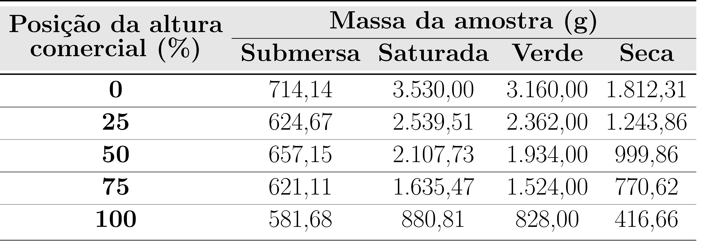
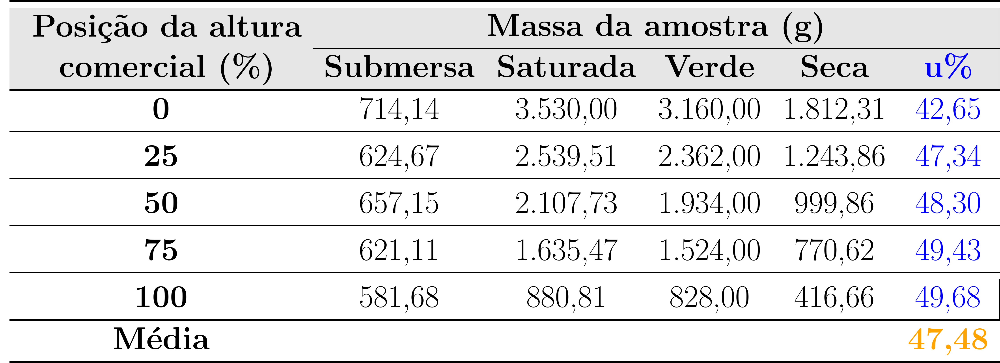
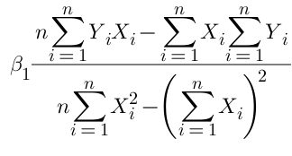
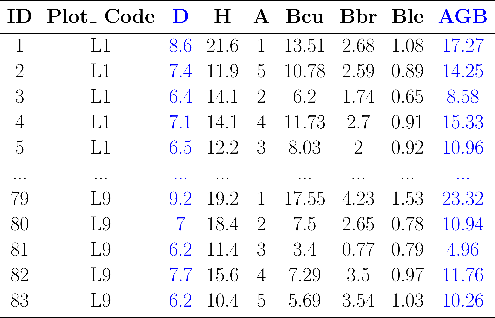
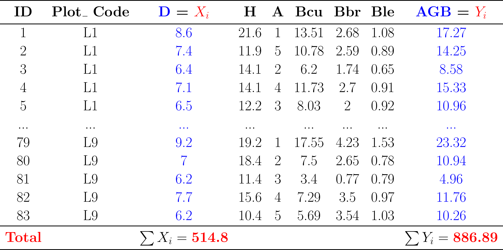
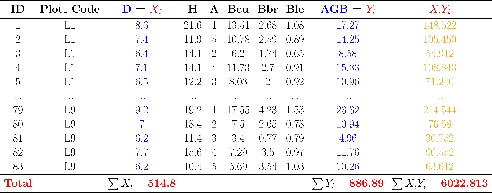

class: title-slide, center, middle
background-image: url(fig/slide-title/ufpa2.png), url(fig/slide-title/forest.png), url(fig/slide-title/img3.png)
background-position: 84% 90%, 95% 90%
background-size: 220px, 90px, cover

```{r setup, include=FALSE}
knitr::opts_chunk$set(
  fig.showtext = TRUE,
  fig.align = "center", 
  cache = FALSE, 
  error = FALSE,
  message = FALSE, 
  warning = FALSE, 
  collapse = TRUE ,
  dpi = 600)
```

```{r packages, include=FALSE}
# remotes::install_github("dill/emoGG")
library(ggplot2)
library(dplyr)
library(ggimage)
```

```{r xaringan-logo, echo=FALSE}
library(xaringanExtra)
use_logo(
  image_url = "fig/slide-title/ufpa.png",
  position = css_position(top = ".8em", right = "-.5em"),
  width = "140px",
  height = "140px"
)
```

```{r customDT, echo=F}
CustomDT <- function(data){
  data %>% DT::datatable(editable = 'cell', rownames = FALSE,
                         style = "default",
                         class = "display", width = '180px',
                         caption = '',
     options=list(pageLength = 20, dom = 't', autoWidth = F,
       initComplete = htmlwidgets::JS(
          "function(settings, json) {",
          paste0("$(this.api().table().container()).css({'font-size': '", "14pt", "'});"),
          "}")
       ) 
     )
}
```

```{r icon, echo=FALSE}
#remotes::install_github("mitchelloharawild/icons")
#library(icons)
#download_fontawesome()
#download_simple_icons()
```

<!-- title-slide -->
# Dendrometria <br> (FL03029)
<br>
## `r anicon::faa("pagelines", animate="horizontal", colour="green")` Biomassa Florestal `r anicon::faa("pagelines", animate="horizontal", colour="green")`

#### **Prof. Dr. Deivison Venicio Souza**
##### Universidade Federal do Pará (UFPA) 
##### Faculdade de Engenharia Florestal
##### E-mail: deivisonvs@ufpa.br
<br>
##### 1ª versão: 03/setembro/2022 <br> (Atualizado em: `r format(Sys.Date(),"%d/%B/%Y")`) <br> Altamira, Pará

---
layout: true
<div class="my-header"></div>
<div class="my-footer"><span>Prof. Dr. Deivison Venicio Souza (E-mail: deivisonvs@ufpa.br)&emsp;&emsp;&emsp;&emsp;&emsp;Dendrometria (FL03029) - Biomassa Florestal</div>

---

## Ementa da disciplina (FL03039 - IF)
<br>

.pull-left-3[
.shadow3[
1 - Introdução à Dendrometria

2 - Medição de Diâmetros de Árvores

3 - Medição de Alturas de Árvores

4 - Relação Hipsométrica

5 - Estudo da Forma do Tronco das Árvores

6 - Volume de Árvores (Métodos de Cubagem)

**7 - Biomassa e Carbono Florestal**

8 - Método de Bitterlich - Relascopia

]
]

---

## Objetivos
<br><br>
Ao final desta aula espera-se que o discente seja capaz de...

.font90[
* Compreender os conceitos básicos associados ao estudo de biomassa e carbono;
* Compreender a importância de determinar (ou estimar) o estoque de biomassa e carbono em ecossistemas florestais;
* Conhecer os principais reservatórios de biomassa e carbono em ecossistemas florestais;
* Compreender os fatores que afetam a produção de biomassa florestal;
* Conhecer os principais métodos de determinação e estimativa da biomassa e carbono florestal;
* Conhecer algumas modelos tradicionais usados na modelagem da biomassa e carbono; e
* Aprender a ajustar um modelo linear para predição da biomassa.
]

---

## Conteúdo

.pull-left[
.pull-top[
**Parte 1 - A Biomassa Florestal**
.font90[

[1 - Conceitos](#con)

[2 - Importância da Biomassa Florestal](#ibf)

[3 - Compartimentação da Biomassa da Árvore](#cba)

[4 - Métodos de Quantificação da Biomassa Vegetal](#mqb)

&nbsp;&nbsp;[4.1 - Métodos Destrutivos](#md)

&nbsp;&nbsp;&nbsp;&nbsp;[4.1.1 - Gravimétrico](#g)

&nbsp;&nbsp;&nbsp;&nbsp;[4.1.2 - Volumétrico](#v)

<!--
&nbsp;&nbsp;&nbsp;&nbsp;[4.1.1 - Árvores Individuais](#ai)

&nbsp;&nbsp;&nbsp;&nbsp;[4.1.2 - Parcelas de Amostragem](#pa)
-->

&nbsp;&nbsp;[4.2 - Métodos Não Destrutivos](#mi)

&nbsp;&nbsp;&nbsp;&nbsp;[4.2.1 - Equações de Biomassa](#eb)

&nbsp;&nbsp;&nbsp;&nbsp;[4.2.2 - Fatores de Expansão de Biomassa](#feb)

[5 - Estudo de Caso: Ajuste de Modelo de Predição da Biomassa (*Bambusa procera*)](#ecmbat)

]
]
]

<!--
.pull-right[
.pull-top[
**Parte 2 - O Carbono Florestal**
.font90[

[1 - Conceitos](#con)

[2 - Reservatórios de Carbono na Floresta](#rcf)

[3 - Conversão da Biomassa em Carbono](#cbc)

]
]
]
-->

<!-- Slide XX -->
---
layout: false
class: inverse, middle, center
background-image: url(fig/class1/sec.png)
background-size: cover

.white[.font200[**Biomassa Florestal:**] <br> .font150[Conceito, Importância, Componentes e Métodos]]

---
layout: true
<div class="my-header"></div>
<div class="my-footer"><span>Prof. Dr. Deivison Venicio Souza (E-mail: deivisonvs@ufpa.br)&emsp;&emsp;&emsp;&emsp;&emsp;Dendrometria (FL03029) - Biomassa Florestal/Parte 1: A Biomassa Florestal</div>

---
name: conc
## Conceitos

.shadow1[
### Biomassa (Higa et al., 2014)
.font90[
- **Biomassa**: refere-se ao total de .blue[matéria orgânica], .blue[morta ou viva], presente .blue[acima e abaixo do solo], existente nos organismos (.blue[animais ou vegetais]) de uma comunidade qualquer.

]
]

--

.shadow1[
### Biomassa Florestal ou Fitomassa (Sanquetta et al., 2002)
.font90[
- **Biomassa florestal**:refere-se à .blue[matéria biológica vegetal], .blue[viva ou morta], existente na  floresta  ou  apenas  na  fração  arbórea.
- **Fitomassa** é uma sinonímia para **biomassa florestal**.
]
]

<br>

.font80[
**Matéria orgânica**: é o conjunto de compostos químicos formados por moléculas orgânicas encontradas em ambientes naturais, sejam terrestres ou aquáticos. (Fonte: [pt.wikipedia.org](https://pt.wikipedia.org/wiki/Mat%C3%A9ria_org%C3%A2nica))
]

---

## Conceitos

.shadow1[
### Biomassa ≠ Massa (Batista et al., 2014)
<br>
.font90[
- **Massa**: Refere-se a massa de um objeto/componente obtida pela .blue[medição direta] deste por meio de .blue[pesagem] (usando uma balança, por exemplo). <br><br> `r anicon::faa("hand-point-right", animate="horizontal", colour="orange")` **Massa Úmida** (ou **Peso Úmido**)<br><br>
- **Biomassa**: Refere-se a .blue[massa] de um objeto/componente, .blue[excluindo-se a água]. <br><br> `r anicon::faa("hand-point-right", animate="horizontal", colour="orange")` **Massa Seca** (ou **Peso Seco**)

]
]

---

## Conceitos

.shadow1[
### Biomassa da árvore (Batista et al., 2014)

- **Biomassa da árvore**: refere-se à .blue[massa dos componentes da árvore], .blue[excluindo-se a água]. Ou seja, diz respeito à massa seca destes componentes.

.center[.blue[**Biomassa da árvore**] = .blue[**Massa seca da árvore**]]

]

--

.shadow1[
### Biomassa é uma medida indireta... (Batista et al., 2014)
.font90[
- Na prática, a .blue[massa ou peso (úmido)] da árvore (e de seus componentes) é uma .blue[medida direta], alcançada por pesagem, após derruba desta em campo.
- No entanto, a .blue[biomassa] da árvore é uma .blue[medida indireta], ou seja, é obtida a partir de outras medidas tomadas diretamente da árvore (ou seja, a partir das medidas de massa úmida).
]
]

--

.font80[
**Biomassa lenhosa**: refere-se à massa da substância madeira (mais casca) de uma árvore. `r anicon::faa("hand-point-right", animate="horizontal", colour="orange")` **Massa Seca do Lenho** (sem água).
]

---
name: cba
## Compartimentação da biomassa da árvore
<br>

```{r, echo=FALSE, out.width='70%', fig.align='center', fig.cap='', dpi=600}
knitr::include_graphics('fig/class7/Henry_2011.png')
```
.font80[**Fonte**: [Henry et al. (2011)](https://hal.inrae.fr/hal-02651041/document)]

---

## Compartimentação da biomassa da árvore
<br>

```{r, echo=FALSE, out.width='85%', fig.align='center', fig.cap='', dpi=600}
knitr::include_graphics('fig/class7/bio1.png')
```

---
name: cbf
## Componentes da biomassa florestal
<br>


---
name: ibf
## Biomassa Florestal: Importância

.shadow1[
### Por que quantificar a biomassa florestal?
<br>
.font90[

**1)** As florestas estão dentre os ecossistemas terrestres que apresentam maior quantidade de biomassa por unidade de área.

**2)** A maior parte da biomassa florestal é representada pelas árvores constituintes do dossel da floresta.

**3)** A biomassa está relacionada aos estoques de macro e micronutrientes da vegetação (.magenta[Higuchi et al., 1998]). Portanto, subsidia a quantificação da ciclagem de nutrientes (.magenta[Silveira et al., 2008]).

**4)** Subsidia estudos relacionados ao **Estoque e Dinâmica de Carbono (C)** nos ecossistemas florestais $\rightarrow$ **Mudanças Climáticas**

**5)** Contribui para compreensão de índices de produtividade e analisar o
crescimento em um determinado sítio.

]
]

---
name: qbva
## Métodos de Quantificação da Biomassa Vegetal

.shadow1[
### Métodos Destrutivos vs Métodos Não Destrutivos
<br>
.font90[
**Métodos Destrutivos**:
- Dois métodos: Gravimétrico e Volumétrico
- Na prática, ambos implicam na derruba do vegetal para pesagem ou cubagem. Por isso, são destrutivos.
- Implicam em determinações, pois as medidas tomadas diretamente em campo, são usadas para determinar a biomassa.
- Análises de laboratórios são exigidas para determinação (em amostras) do teor de umidade ou densidade básica da madeira.

**Métodos Não Destrutivos**: 
- Implicam no uso de modelos de regressão, técnicas de sensoriamento remoto, outros.
]
]

---

## Métodos de Quantificação da Biomassa Vegetal

.shadow1[
### .font80[Métodos Destrutivos: Gravimétrico x Volumétrico (Batista et al., 2014)]
<br>
.font90[
**Gravimétrico**: 

- A biomassa é obtida com base em medidas da .blue[*massa verde*], determinada após derruba do vegetal/árvore em campo, e do .blue[*teor de umidade*] de amostras, determinado em laboratório.

**Volumétrico**: 
- A biomassa é obtida com base no volume, obtido por cubagem rigorosa, após derruba do vegetal/árvore em campo, e da .blue[*densidade básica da madeira*] em amostras, determinada em laboratório. (**Ideal**: Árvores/galhos de grande porte)
]
]

---
name: qbf
## Métodos de Quantificação da Biomassa Vegetal

.shadow1[
### Determinação da biomassa em campo: Gravimétrico
]

```{r, echo=FALSE, out.width='75%', fig.align='center', fig.cap='', dpi=600}
knitr::include_graphics('fig/class7/bio2.png')
```

---

## Métodos de Quantificação da Biomassa Vegetal

.shadow1[
### .font80[Determinação do Teor de Umidade (Batista et al., 2014)]
.font90[
- No método gravimétrico, é necessário a determinação do teor de umidade em amostras dos componentes da árvore/vegetal.
- O teor de umidade é obtido pela seguinte fórmula:
]<br>

$$
\begin{equation*}
u_{\%} = \dfrac{m_v - m_s}{m_v}*100
\end{equation*}
$$

.font90[
Em que: $m_v$ = massa verde da amostra; $m_s$ = massa seca da amostra.

- A .blue[*massa verde*] da amostra é determinada em campo (balança de precisão).
- A .blue[*massa seca*] da amostra é determinada em laboratório (estufa de circulação forçada).
]
]

---

## Métodos de Quantificação da Biomassa Vegetal

.shadow1[
### .font80[Determinação do Teor de Umidade (Batista et al., 2014)]
<br>
.font90[
**Sobre a amostragem dos componentes:**

- **Menor Massa** (galhos finos, folhas, raízes finas): Amostra aleatória de $\approx 300 g$.
- **Lenho (fuste)**: Retirar discos (5 cm espessura) em 5 posições relativas do tronco (Por exemplo: 0%, 25%, 50%, 75%, 100% da altura total)
<br>

**Em laboratório:**
- As amostras (folhas, galhos, raízes, etc.) são colocadas em estufa de circulação forçada à temperatura constante de 103°C, até atingir peso constante. Na prática, o .blue[*peso contante*] = .blue[*massa seca da amostra*] - $m_s$.
- **Discos**: o teor de umidade é determinado para cada disco, usando-se a média com teor de umidade representativo do lenho.

]
]

---

## Métodos de Quantificação da Biomassa Vegetal

.shadow1[
### .font80[Cálculo da biomassa - Método Gravimétrico (Batista et al., 2014)]

.font90[
- Determinada a .blue[*massa verde*] em campo (de cada componente) e o .blue[teor de umidade] das amostras em laboratório, a biomassa dos componentes da árvore pode ser calculada por: <br>

$$
\begin{equation*}
b_L = m_L\left(1 -\dfrac{u_{L\%}}{100}\right) \rightarrow Biomassa~do~Lenho \\~\\
b_R = m_R\left(1 -\dfrac{u_{R\%}}{100}\right) \rightarrow Biomassa~de~Ramos \\~\\
b_F = m_F\left(1 -\dfrac{u_{F\%}}{100}\right) \rightarrow Biomassa~de~Folhas \\~\\
ba = b_L + b_R + b_F \rightarrow Biomassa~Aérea
\end{equation*}
$$
Em que: $b_L$, $b_R$ e $b_F$: biomassa do lenho, ramos e folhas, respectivamente, em kg; $m_L$, $m_R$ e $m_F$: massa verde do lenho, ramos e folhas, respectivamente, em kg; e $u_{L\%}$, $u_{R\%}$ e $u_{F\%}$: teor de umidade do lenho, ramos e folhas, respectivamente.


]
]

---

## Métodos de Quantificação da Biomassa Vegetal

.shadow1[
### .font80[Exercício Prático - Cálculo da Biomassa (Batista et al., 2014)]

- 1) Utilizando as informações apresentadas na tabela abaixo, encontre a **Biomassa do Lenho** da árvore por meio do **Método Gravimétrico**: (Batista et al., 2014; pg. 82)
]

.pull-left-15[
```{r, echo=FALSE, out.width='90%', fig.align='center', fig.cap='', dpi=600}

```
.font80[**Fonte**: Batista et al., 2014]
]

.pull-right-14[
.shadow3[
.font90[
Informações dos discos do tronco tomados como amostra na determinação da biomassa lenhosa de uma árvore. Informações da árvore: espécie ipê-felpudo (*Zeyhera tuberculosa* (Vell.) Bureau, Bignoneaceae), DAP = 28 cm; Altura total = 16 m; Volume do lenho: 550 $dm^3$; Massa verde do lenho = 435,5 kg.
]
]
]

---

## Métodos de Quantificação da Biomassa Vegetal

.shadow1[
### .font80[Exercício Prático - Cálculo da Biomassa (Batista et al., 2014)]
.font90[
- **Passo 1**: Encontrar o .blue[teor de umidade] de cada disco de madeira, na sequência obter a média.

$$
\begin{equation*}
u_{\%} = \dfrac{m_v - m_s}{m_v}*100
\end{equation*}
$$

.font90[
Em que: $m_v$ = massa verde da amostra; $m_s$ = massa seca da amostra.
]
]
]

```{r, echo=FALSE, out.width='60%', fig.align='center', fig.cap='', dpi=600}

```

---

## Métodos de Quantificação da Biomassa Vegetal

.shadow1[
### .font80[Exercício Prático - Cálculo da Biomassa (Batista et al., 2014)]
.font90[
- **Passo 2**: Aplicar a equação para determinar a biomassa, em função da .blue[massa verde do lenho] e .blue[teor de umidade médio] do lenho. (**Lembre-se**: Massa verde do lenho = 435,5 kg)

$$
\Large
\begin{equation*}
b_L = m_L\left(1 -\dfrac{u_{L\%}}{100}\right) \\~\\
b_L = 435,5\left(1 -\dfrac{47,48}{100}\right) = \color{blue}{228,72~kg}
\end{equation*}
$$


]
]

<!-- Slide XX -->
---
layout: false
class: inverse, middle, center
background-image: url(fig/class1/sec.png)
background-size: cover

.white[.font200[**Estudo de Caso**] <br> .font150[Ajuste de Modelo de Predição da Biomassa <br> (*Bambusa procera*)]]

---
layout: true
<div class="my-header"></div>
<div class="my-footer"><span>Prof. Dr. Deivison Venicio Souza (E-mail: deivisonvs@ufpa.br)&emsp;&emsp;&emsp;&emsp;&emsp;Dendrometria (FL03029) - Biomassa Florestal/Parte 1: A Biomassa Florestal</div>

---
name: ma
## Ajuste de Modelo de Predição da Biomassa

.shadow1[
### Estudo de Caso I - *Bambusa procera* (Huy; Long, 2019)
<br>
.font90[
Para ilustrar o procedimento de ajuste de um modelo de predição de biomassa, será usado um conjunto de dados disponível no **Anexo 1** do documento intitulado: **A manual for bamboo forest biomass and carbon assessment** ([Huy; Long, 2019](https://www.researchgate.net/publication/333718544_A_Manual_for_Bamboo_Forest_Biomass_and_Carbon_Assessment)). Tratam-se de dados de biomassa da espécie *Bambusa procera*. Estão disponíveis dados de 83 indivíduos e medidas de biomassa de diversos componentes (folhas, galhos, colmo, etc.).
]
]
<br>

.font90[
**Conjunto de dados**

- Espécie: *Bambusa procera*
- número de observações: n = 83
- Acesse os dados em planilha: [DataSet_Bambusa](https://github.com/DeivisonSouza/FL03029-Dendrometria/tree/master/Slides/Data/DataSet_Bambusa.csv)
]

---

## Ajuste de Modelo de Predição da Biomassa

.pull-right-14[
<br>

.shadow3[
#### .center[**Variáveis**]

.font48[
- Plot-Code: Código da Parcela
- Plant-Code: Código da planta
- X e Y: coordenadas
- D, H e A: Diâmetro (cm), Altura e Idade (anos)
- Bfcu: Biomassa fresca de colmos (kg)
- Bfbr: Biomassa fresca de galhos (kg)
- Bfle: Biomassa fresca de folhas (kg)
- AGBf: Somatório (Bfcu, Bfbr, Bfle)
- RatioBcu: Razão de massa fresca-seca de colmos
- RatioBbr: Razão de massa fresca-seca de galhos
- RatioBle: Razão de massa fresca-seca de folhas
- Bcu: Biomassa seca de colmos (kg)
- Bbr: Biomassa seca de galhos (kg)
- Ble: Biomassa seca de folhas (kg)
- AGB: Somatório (Bcu, Bbr, Ble) 
]
]

<br>

.font70[**Fonte**: [Huy; Long, 2019](https://www.researchgate.net/publication/333718544_A_Manual_for_Bamboo_Forest_Biomass_and_Carbon_Assessment)
]
]

.pull-left-15[
```{r, echo=FALSE, out.width='100%', fig.align='center', fig.cap='', dpi=600}
knitr::include_graphics('fig/class7/boo1.png')
```
]

---

## Ajuste de Modelo de Predição da Biomassa

.pull-right-14[
<br>

.shadow3[
#### .center[**Variáveis**]

.font48[
- Plot-Code: Código da Parcela
- Plant-Code: Código da planta
- X e Y: coordenadas
- D, H e A: Diâmetro (cm), Altura e Idade (anos)
- Bfcu: Biomassa fresca de colmos (kg)
- Bfbr: Biomassa fresca de galhos (kg)
- Bfle: Biomassa fresca de folhas (kg)
- AGBf: Somatório (Bfcu, Bfbr, Bfle)
- RatioBcu: Razão de massa fresca-seca de colmos
- RatioBbr: Razão de massa fresca-seca de galhos
- RatioBle: Razão de massa fresca-seca de folhas
- Bcu: Biomassa seca de colmos (kg)
- Bbr: Biomassa seca de galhos (kg)
- Ble: Biomassa seca de folhas (kg)
- AGB: Somatório (Bcu, Bbr, Ble) 
]
]

<br>

.font70[**Fonte**: [Huy; Long, 2019](https://www.researchgate.net/publication/333718544_A_Manual_for_Bamboo_Forest_Biomass_and_Carbon_Assessment)
]
]

.pull-left-15[
```{r, echo=FALSE, out.width='92%', fig.align='center', fig.cap='', dpi=600}
knitr::include_graphics('fig/class7/boo2.png')
```
]


---

## Ajuste de Modelo de Predição da Biomassa

.pull-right-14[
<br>

.shadow3[
#### .center[**Variáveis**]

.font48[
- Plot-Code: Código da Parcela
- Plant-Code: Código da planta
- X e Y: coordenadas
- D, H e A: Diâmetro (cm), Altura e Idade (anos)
- Bfcu: Biomassa fresca de colmos (kg)
- Bfbr: Biomassa fresca de galhos (kg)
- Bfle: Biomassa fresca de folhas (kg)
- AGBf: Somatório (Bfcu, Bfbr, Bfle)
- RatioBcu: Razão de massa fresca-seca de colmos
- RatioBbr: Razão de massa fresca-seca de galhos
- RatioBle: Razão de massa fresca-seca de folhas
- Bcu: Biomassa seca de colmos (kg)
- Bbr: Biomassa seca de galhos (kg)
- Ble: Biomassa seca de folhas (kg)
- AGB: Somatório (Bcu, Bbr, Ble) 
]
]

<br>

.font70[**Fonte**: [Huy; Long, 2019](https://www.researchgate.net/publication/333718544_A_Manual_for_Bamboo_Forest_Biomass_and_Carbon_Assessment)
]
]

.pull-left-15[
```{r, echo=FALSE, out.width='100%', fig.align='center', fig.cap='', dpi=600}
knitr::include_graphics('fig/class7/boo3.png')
```
]

---

## Ajuste de Modelo de Predição da Biomassa

.shadow1[
### **Estratégias de Modelagem...**
<br>
.font80[
- No dataset *Bambusa procera* de [Huy; Long, 2019](https://www.researchgate.net/publication/333718544_A_Manual_for_Bamboo_Forest_Biomass_and_Carbon_Assessment), estão disponíveis dados da Biomassa Aérea Total (do inglês, *Above-Ground Biomass - AGB*). Neste caso, a AGB foi determinada pelo somatório da biomassa (massa seca) de folhas, galhos e colmo.
- É possível "pensar" em algumas estratégias de modelagem: **1) Modelagem por componentes**; e 2) **Modelagem por compartimento**.
- Por exemplo, poderíamos desenvolver modelos específicos para a predição da biomassa de folhas (Ble), galhos (Bbr) ou colmo (Bcu), e também um modelo para predizer a biomassa aérea total (AGB = Bcu + Bbr + Ble).
]
]

---

## Ajuste de Modelo de Predição da Biomassa

.shadow1[
### **Modelo Para Predizer a Biomassa Aérea Total**
<br>
.font80[
- Vamos ajustar um modelo para predizer a AGB da espécie *Bambusa procera*.
- Inicialmente, para fins de treinamento e intuição, vamos usar apenas os dados das .blue[primeiras 20 árvores].
- Vamos admitir o modelo mais simples: $AGB = \beta_0 + \beta_1d$ (modelo linear).
- O modelo $(AGB = \beta_0 + \beta_1d)$ usa o diâmetro (d) dos colmos como variável preditora/independente, e a $AGB$ é a variável resposta/dependente.
- Portanto, para ajustar o modelo são necessárias apenas as variáveis: $d$ e $AGB$.
]
]

---

## Ajuste de Modelo de Predição da Biomassa

.shadow1[
### **Modelo de Regressão Linear Simples (RLS)**
<br>
.font80[
**Método dos Mínimos Quadrados Ordinários (MQO)**: 

- Ajustar modelos de regressão consiste em determinar as estimativas dos coeficientes da regressão. 
- Em se tratando de modelos de RLS, os valores dos coeficientes da regressão podem ser obtidos pelo método dos Mínimos Quadrados Ordinários (MQO):

.center[**1) Estimativa do Parâmetro β₁**:]

```{r, echo=FALSE, out.width='25%', fig.align='center', fig.cap='', dpi=600}

```

.center[**2) Estimativa do Parâmetro β₀**:]

$$
\begin{equation*}
\beta_0 = \bar{Y} - \beta_1\bar{X}
\end{equation*}
$$

]
]

---

## Ajuste de Modelo de Predição da Biomassa
<br>

.pull-left-2[
Modelo: $\color{blue}{AGB = \beta_0 + \beta_1d}$ $\rightarrow$ $\color{orange}{Y_i = \beta_0 + \beta_1X_i}$
<br>

```{r, echo=FALSE, out.width='80%', fig.align='left', fig.cap='', dpi=600}

```
]

--

.pull-right-1[
<br><br>
.center[**1) Estimativa do Parâmetro β₁**:]

```{r, echo=FALSE, out.width='75%', fig.align='center', fig.cap='', dpi=600}

```

.center[**2) Estimativa do Parâmetro β₀**:]

$$
\begin{equation*}
\beta_0 = \bar{Y} - \beta_1\bar{X}
\end{equation*}
$$
]

---

## Ajuste de Modelo de Predição da Biomassa
<br>

Modelo: $\color{blue}{AGB = \beta_0 + \beta_1d}$ $\rightarrow$ $\color{orange}{Y_i = \beta_0 + \beta_1X_i}$
<br>

```{r, echo=FALSE, out.width='75%', fig.align='left', fig.cap='', dpi=600}

```

---

## Ajuste de Modelo de Predição da Biomassa
<br>

Modelo: $\color{blue}{AGB = \beta_0 + \beta_1d}$ $\rightarrow$ $\color{orange}{Y_i = \beta_0 + \beta_1X_i}$
<br>

```{r, echo=FALSE, out.width='90%', fig.align='left', fig.cap='', dpi=600}

```


---

## Ajuste de Modelo de Predição da Biomassa
<br>

Modelo: $\color{blue}{AGB = \beta_0 + \beta_1d}$ $\rightarrow$ $\color{orange}{Y_i = \beta_0 + \beta_1X_i}$
<br>

```{r, echo=FALSE, out.width='100%', fig.align='left', fig.cap='', dpi=600}
knitr::include_graphics('fig/class7/tab5.png')
```

---

## Ajuste de Modelo de Predição da Biomassa
<br>

Modelo: $\color{blue}{AGB = \beta_0 + \beta_1d}$ $\rightarrow$ $\color{orange}{Y_i = \beta_0 + \beta_1X_i}$
<br>

.pull-left-1[
$$
\begin{equation*}
n = 83 \\
\sum_{i=1}^{n}X_i = 514,8 \\
\sum_{i=1}^{n}Y_i = 886,89 \\
\sum_{i=1}^{n}X_iY_1 = 6022,813 \\
\sum_{i=1}^{n}X_i^2 = 3329,08 \\
\bar{Y} = 10,69 \\
\bar{X} = 6,20
\end{equation*}
$$
]

.pull-right-2[

.center[**1) Estimativa do Parâmetro β₁**:]

$$
\begin{equation*}
\beta_1 = \dfrac{83(6022,813)-(514,8)(886,89)}{83(3329,08)-(514,8)^2} \approx \color{blue}{3,8357}
\end{equation*}
$$

<br><br>

.center[**2) Estimativa do Parâmetro β₀**:]

$$
\begin{equation*}
\beta_0 = \bar{Y} - \beta_1\bar{X} = 10,69 - 3,8357(6,20) = \color{blue}{-13,0913}
\end{equation*}
$$

<br>

**Modelo ajustado**: $\color{blue}{AGB = -13,0913 + 3,8357d}$

]

<!-- Slide XX -->
---
layout: false
class: inverse, middle, center
background-image: url(fig/class1/sec.png)
background-size: cover

.white[.font200[**Estudo de Caso**] <br> .font150[Ajuste de Modelo de Predição da Biomassa <br> (*Bambusa procera*) <br><br> **Vamos Praticar! 😁**]]

---
layout: true
<div class="my-header"></div>
<div class="my-footer"><span>Prof. Dr. Deivison Venicio Souza (E-mail: deivisonvs@ufpa.br)&emsp;&emsp;&emsp;&emsp;&emsp;Dendrometria (FL03029) - Biomassa Florestal/Parte 1: A Biomassa Florestal</div>

---
name: ma
## Ajuste de Modelo de Predição da Biomassa

.shadow1[
### Estudo de Caso I - *Bambusa procera* (Huy; Long, 2019)
<br>
.font90[
**Agora é sua vez!** 😁

Usando o mesmo conjunto de dados disponível no **Anexo 1** do documento intitulado: **A manual for bamboo forest biomass and carbon assessment** ([Huy; Long, 2019](https://www.researchgate.net/publication/333718544_A_Manual_for_Bamboo_Forest_Biomass_and_Carbon_Assessment)). Ajuste o modelo linear $(AGB = \beta_0 + \beta_1d)$. Porém, agora use o conjunto de dados completo (n = 83) para o ajuste.
]
]
<br>

.font90[
**Conjunto de dados**

- Espécie: *Bambusa procera*
- número de observações: n = 83
- Acesse os dados em planilha: [DataSet_Bambusa](https://github.com/DeivisonSouza/FL03029-Dendrometria/tree/master/Slides/Data/DataSet_Bambusa.csv)
]

---

## Ajuste de Modelo de Predição da Biomassa

.pull-right-14[
<br>

.shadow3[
#### .center[**Variáveis**]

.font48[
- Plot-Code: Código da Parcela
- Plant-Code: Código da planta
- X e Y: coordenadas
- D, H e A: Diâmetro (cm), Altura e Idade (anos)
- Bfcu: Biomassa fresca de colmos (kg)
- Bfbr: Biomassa fresca de galhos (kg)
- Bfle: Biomassa fresca de folhas (kg)
- AGBf: Somatório (Bfcu, Bfbr, Bfle)
- RatioBcu: Razão de massa fresca-seca de colmos
- RatioBbr: Razão de massa fresca-seca de galhos
- RatioBle: Razão de massa fresca-seca de folhas
- Bcu: Biomassa seca de colmos (kg)
- Bbr: Biomassa seca de galhos (kg)
- Ble: Biomassa seca de folhas (kg)
- AGB: Somatório (Bcu, Bbr, Ble) 
]
]

<br>

.font70[**Fonte**: [Huy; Long, 2019](https://www.researchgate.net/publication/333718544_A_Manual_for_Bamboo_Forest_Biomass_and_Carbon_Assessment)
]
]

.pull-left-15[
```{r, echo=FALSE, out.width='100%', fig.align='center', fig.cap='', dpi=600}
knitr::include_graphics('fig/class7/boo1.png')
```
]

---

## Ajuste de Modelo de Predição da Biomassa

.pull-right-14[
<br>

.shadow3[
#### .center[**Variáveis**]

.font48[
- Plot-Code: Código da Parcela
- Plant-Code: Código da planta
- X e Y: coordenadas
- D, H e A: Diâmetro (cm), Altura e Idade (anos)
- Bfcu: Biomassa fresca de colmos (kg)
- Bfbr: Biomassa fresca de galhos (kg)
- Bfle: Biomassa fresca de folhas (kg)
- AGBf: Somatório (Bfcu, Bfbr, Bfle)
- RatioBcu: Razão de massa fresca-seca de colmos
- RatioBbr: Razão de massa fresca-seca de galhos
- RatioBle: Razão de massa fresca-seca de folhas
- Bcu: Biomassa seca de colmos (kg)
- Bbr: Biomassa seca de galhos (kg)
- Ble: Biomassa seca de folhas (kg)
- AGB: Somatório (Bcu, Bbr, Ble) 
]
]

<br>

.font70[**Fonte**: [Huy; Long, 2019](https://www.researchgate.net/publication/333718544_A_Manual_for_Bamboo_Forest_Biomass_and_Carbon_Assessment)
]
]

.pull-left-15[
```{r, echo=FALSE, out.width='92%', fig.align='center', fig.cap='', dpi=600}
knitr::include_graphics('fig/class7/boo2.png')
```
]


---

## Ajuste de Modelo de Predição da Biomassa

.pull-right-14[
<br>

.shadow3[
#### .center[**Variáveis**]

.font48[
- Plot-Code: Código da Parcela
- Plant-Code: Código da planta
- X e Y: coordenadas
- D, H e A: Diâmetro (cm), Altura e Idade (anos)
- Bfcu: Biomassa fresca de colmos (kg)
- Bfbr: Biomassa fresca de galhos (kg)
- Bfle: Biomassa fresca de folhas (kg)
- AGBf: Somatório (Bfcu, Bfbr, Bfle)
- RatioBcu: Razão de massa fresca-seca de colmos
- RatioBbr: Razão de massa fresca-seca de galhos
- RatioBle: Razão de massa fresca-seca de folhas
- Bcu: Biomassa seca de colmos (kg)
- Bbr: Biomassa seca de galhos (kg)
- Ble: Biomassa seca de folhas (kg)
- AGB: Somatório (Bcu, Bbr, Ble) 
]
]

<br>

.font70[**Fonte**: [Huy; Long, 2019](https://www.researchgate.net/publication/333718544_A_Manual_for_Bamboo_Forest_Biomass_and_Carbon_Assessment)
]
]

.pull-left-15[
```{r, echo=FALSE, out.width='100%', fig.align='center', fig.cap='', dpi=600}
knitr::include_graphics('fig/class7/boo3.png')
```
]

---

## Ajuste de Modelo de Predição da Biomassa

.shadow1[
### **Estratégias de Modelagem...**
<br>
.font80[
- No dataset *Bambusa procera* de [Huy; Long, 2019](https://www.researchgate.net/publication/333718544_A_Manual_for_Bamboo_Forest_Biomass_and_Carbon_Assessment), estão disponíveis dados da Biomassa Aérea Total (do inglês, *Above-Ground Biomass - AGB*). Neste caso, a AGB foi determinada pelo somatório da biomassa (massa seca) de folhas, galhos e colmo.
- É possível "pensar" em algumas estratégias de modelagem: **1) Modelagem por componentes**; e 2) **Modelagem por compartimento**.
- Por exemplo, poderíamos desenvolver modelos específicos para a predição da biomassa de folhas (Ble), galhos (Bbr) ou colmo (Bcu), e também um modelo para predizer a biomassa aérea total (AGB = Bcu + Bbr + Ble).
]
]

---

## Ajuste de Modelo de Predição da Biomassa

.shadow1[
### **Modelo Para Predizer a Biomassa Aérea Total**
<br>
.font80[
- Vamos ajustar um modelo para predizer a AGB da espécie *Bambusa procera*.
- Para tanto, inicialmente, vamos admitir o modelo mais simples: $AGB = \beta_0 + \beta_1d$ (modelo linear).
- O modelo $(AGB = \beta_0 + \beta_1d)$ usa o diâmetro (D) dos colmos como variável preditora/independente, e a $AGB$ é a variável resposta/dependente.
- Portanto, para ajustar o modelo são necessárias apenas as variáveis: $d$ e $AGB$.
]
]

---

## Ajuste de Modelo de Predição da Biomassa
<br>

.pull-left-2[
Modelo: $\color{blue}{AGB = \beta_0 + \beta_1d}$ $\rightarrow$ $\color{orange}{Y_i = \beta_0 + \beta_1X_i}$
<br>

```{r, echo=FALSE, out.width='80%', fig.align='left', fig.cap='', dpi=600}

```
]

--

.pull-right-1[
<br><br>
.center[**1) Estimativa do Parâmetro β₁**:]

```{r, echo=FALSE, out.width='75%', fig.align='center', fig.cap='', dpi=600}

```

.center[**2) Estimativa do Parâmetro β₀**:]

$$
\begin{equation*}
\beta_0 = \bar{Y} - \beta_1\bar{X}
\end{equation*}
$$
]

---

## Ajuste de Modelo de Predição da Biomassa
<br>

Modelo: $\color{blue}{AGB = \beta_0 + \beta_1d}$ $\rightarrow$ $\color{orange}{Y_i = \beta_0 + \beta_1X_i}$
<br>

```{r, echo=FALSE, out.width='75%', fig.align='left', fig.cap='', dpi=600}

```

---

## Ajuste de Modelo de Predição da Biomassa
<br>

Modelo: $\color{blue}{AGB = \beta_0 + \beta_1d}$ $\rightarrow$ $\color{orange}{Y_i = \beta_0 + \beta_1X_i}$
<br>

```{r, echo=FALSE, out.width='90%', fig.align='left', fig.cap='', dpi=600}

```


---

## Ajuste de Modelo de Predição da Biomassa
<br>

Modelo: $\color{blue}{AGB = \beta_0 + \beta_1d}$ $\rightarrow$ $\color{orange}{Y_i = \beta_0 + \beta_1X_i}$
<br>

```{r, echo=FALSE, out.width='100%', fig.align='left', fig.cap='', dpi=600}
knitr::include_graphics('fig/class7/tab5.png')
```

---

## Ajuste de Modelo de Predição da Biomassa
<br>

Modelo: $\color{blue}{AGB = \beta_0 + \beta_1d}$ $\rightarrow$ $\color{orange}{Y_i = \beta_0 + \beta_1X_i}$
<br>

.pull-left-1[
$$
\begin{equation*}
n = 83 \\
\sum_{i=1}^{n}X_i = 514,8 \\
\sum_{i=1}^{n}Y_i = 886,89 \\
\sum_{i=1}^{n}X_iY_1 = 6022,813 \\
\sum_{i=1}^{n}X_i^2 = 3329,08 \\
\bar{Y} = 10,69 \\
\bar{X} = 6,20
\end{equation*}
$$
]

.pull-right-2[

.center[**1) Estimativa do Parâmetro β₁**:]

$$
\begin{equation*}
\beta_1 = \dfrac{83(6022,813)-(514,8)(886,89)}{83(3329,08)-(514,8)^2} \approx \color{blue}{3,8357}
\end{equation*}
$$

<br><br>

.center[**2) Estimativa do Parâmetro β₀**:]

$$
\begin{equation*}
\beta_0 = \bar{Y} - \beta_1\bar{X} = 10,69 - 3,8357(6,20) = \color{blue}{-13,0913}
\end{equation*}
$$

<br>

**Modelo ajustado**: $\color{blue}{AGB = -13,0913 + 3,8357d}$

]

---

## Ajuste de Modelo de Predição da Biomassa
<br>

.pull-left-2[
.shadow1[
### Fazendo Predições...
<br>
.font90[
Para efeito de utilização do modelo ajustado, considere 10 indivíduos da espécie *Bambusa procera* com $d$ (diâmetro a 1,30 m do solo, em cm) medido em campo. Pergunta-se: Qual o valor predito da AGB (em Kg), admitindo que o modelo ajustado $(\color{blue}{AGB = -13,0913 + 3,8357d})$ têm acurácia razoável (Obs.: O modelo precisa ser avaliado quanto a acurácia, mas isso será tópico futuro!)?
]
]
]


.font90[
.pull-right-1[

```{r tibble, echo=F, eval=T}
data <- readr::read_csv("Data/sample.csv")
data %>% CustomDT
```
]
]

---

## Referências

.font80[
<br>
Batista, J. L. F., Couto, H. T. Z., & Silva Filho, D. F. **Quantificação de recursos florestais**. 1. ed., São Paulo: Oficina de Textos, 2014.
<br><br>
Higa, R. C. V., Cardoso, D. J., Andrade, G. D. C., Zanatta, J. A., Rossi, L. M. B., Pulrolnik, K., ... & SALIS, S. D. Protocolo de medição e estimativa de biomassa e carbono florestal. **Colombo: Embrapa Florestas**, v. 1, 2014.
<br><br>
Henry, M., Picard, N., Trotta, C., Manlay, R., Valentini, R., Bernoux, M., & Saint-André, L. Estimating tree biomass of sub-Saharan African forests: a review of available allometric equations. **Silva Fennica**, v. 45, n. 3, p. 477-569, 2011.
<br><br>
Higuchi, N., SANTOS, J., Ribeiro, R. J., Minette, L., & Biot, Y. Biomassa da parte aérea da vegetação da floresta tropical úmida de terra-firme da Amazônia brasileira. **Acta Amazonica**, v. 28, p. 153-153, 1998.
<br><br>
Huy, B.; Long, T. T. A manual for bamboo forest biomass and carbon assessment. **International Bamboo and Rattan Organization**, Beijing, China, 2019.
<br><br>
Sanquetta, C. R. Métodos de determinação de biomassa florestal. In: Sanquetta, C. R. et al. (Eds.). **As florestas e o carbono**. Curitiba: [s.n.], 2002, p. 119-140.
<br><br>
Silveira, P., Koehler, H. S., Sanquetta, C. R., & Arce, J. E. O estado da arte na estimativa de biomassa e carbono em formações florestais. **Floresta**, v. 38, n. 1, 2008.
<br><br>

]


